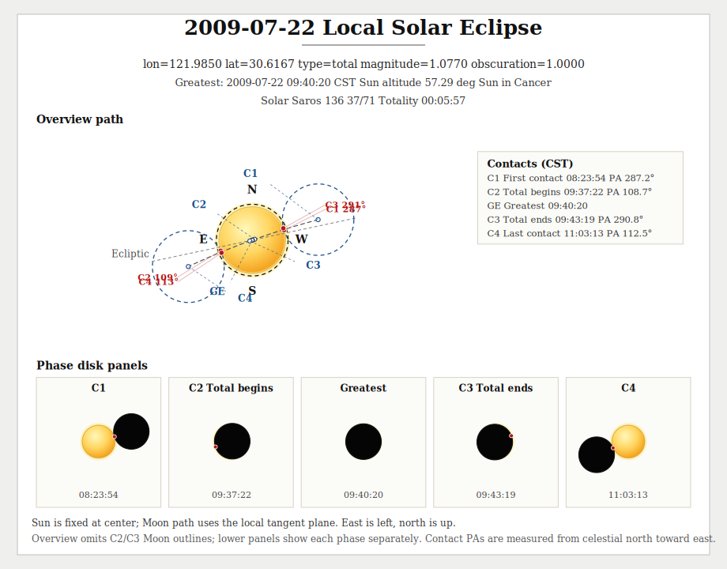
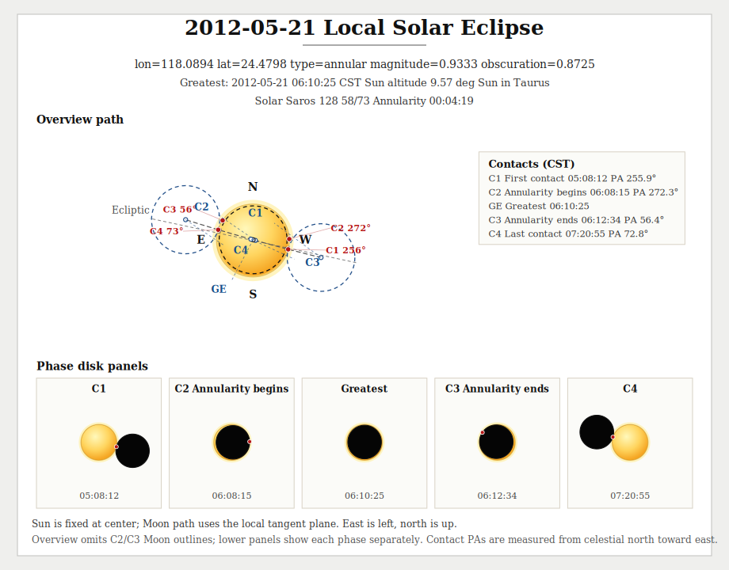
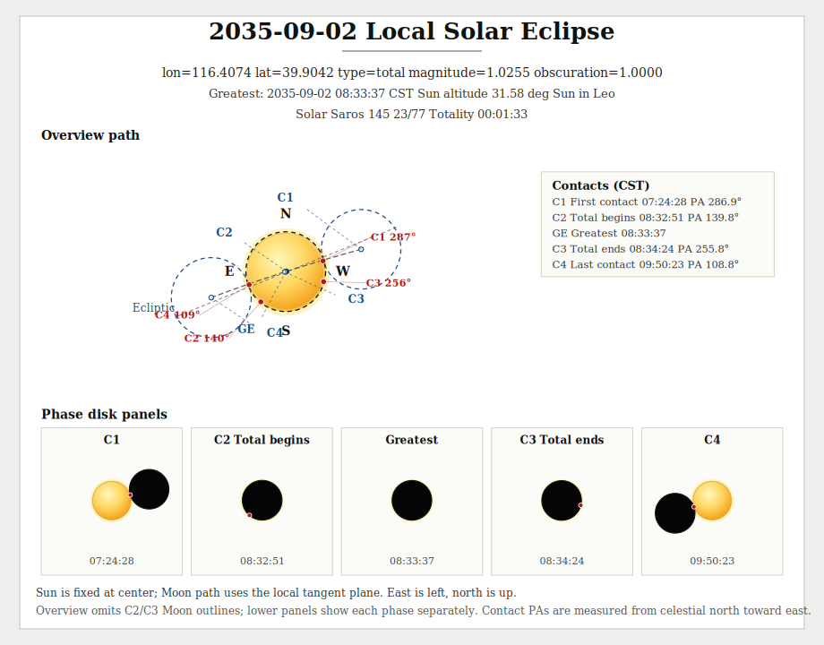
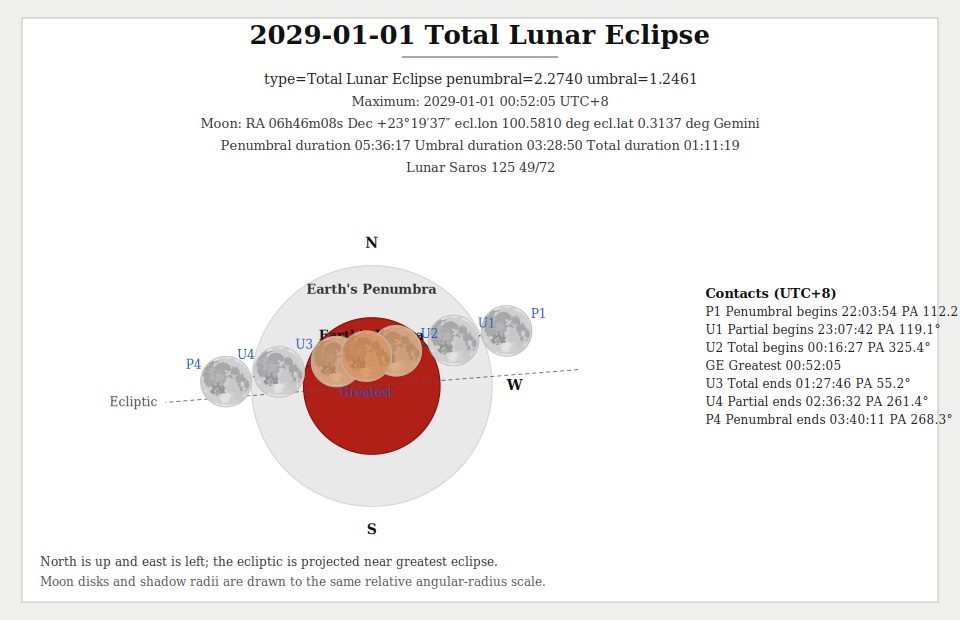

# Astro

**English | [中文](README.md)**

[](https://pkg.go.dev/github.com/starainrt/astro)

A personal astronomy library developed over years for calendrical work, amateur observing, outreach demos, and lightweight research.

> This project is mainly for learning and validating astronomical algorithms. The results are intended for serious amateur use.

The implementation follows *Astronomical Algorithms* and provides calendar conversion, Sun/Moon/planet positions, eclipses, rise/set/transit times, lunar phases, stars, coordinate transforms, physical ephemerides, research formulas, and generic small-body orbit propagation. The Sun and planets use built-in VSOP87-style analytical terms, while the Moon uses a built-in ELP2000/82-style series. No external JPL ephemeris files are required.

Unless noted otherwise, coordinates are apparent-of-date coordinates. Angles are in degrees, apparent diameters and semidiameters are in arcseconds, and distances use the unit implied by the function name, usually `AU` or `km`.

## Contents

- [Install](#install)
- [Highlights](#highlights)
- [Package Overview](#package-overview)
- [Scope And Accuracy](#scope-and-accuracy)
- [Quick Start](#quick-start)
  - [Calendar And Solar Terms](#calendar-and-solar-terms)
  - [Sun And Moon](#sun-and-moon)
  - [Lite Sun And Moon](#lite-sun-and-moon)
  - [Solar Eclipse](#solar-eclipse)
  - [Lunar Eclipse](#lunar-eclipse)
  - [Planets](#planets)
  - [Stars](#stars)
  - [Coordinate Tools](#coordinate-tools)
  - [Formula Helpers](#formula-helpers)
  - [Generic Small-Body Orbits](#generic-small-body-orbits)
  - [Sundial And Apparent Solar Time](#sundial-and-apparent-solar-time)
- [Implemented](#implemented)
- [TODO](#todo)

## Install

```bash
go get github.com/starainrt/astro
```

## Highlights

- Calendar conversion between Gregorian dates and the traditional Chinese lunisolar calendar, including solar terms
- Solar position, rise/set, Earth distance, apparent solar time, apparent altitude, parallactic angle, solar `P/B0/L0`, apparent diameter
- Lunar position, rise/set, Earth distance, phase, new/full/quarter times, apparent diameter, bright-limb angle, parallactic angle, geocentric/topocentric libration, apsides, nodes, maximum declination
- `lite/sun` and `lite/moon` lightweight approximation chains for watches, frontends, mini programs, and other resource-constrained environments
- Global and local solar/lunar eclipses, solar central paths, partial footprints, visible local lunar eclipses, Saros metadata, and SVG diagrams
- Seven major planets with positions, rise/set, conjunction/opposition/station events, quadratures, elongations, Mercury/Venus geocentric transits, nodes, phase, apparent magnitude, apparent diameter, parallactic angle, and physical ephemerides
- 9100+ star catalog entries, constellation lookup, proper-motion propagation, rise/set, parallactic angle, and apparent altitude
- Coordinate transforms, topocentric coordinates, sidereal time, precession, nutation, angular distance, refraction, airmass, parallactic angle, and Galactic coordinates
- Standalone formulas for blackbody radiation, synodic periods, photometry, telescope limiting magnitude, stellar radius/temperature/luminosity relations, and airmass models
- Generic heliocentric two-body orbit propagation for asteroids, comets, dwarf planets, and hypothetical objects, including phase/photometry helpers and visual-binary position solving
- Apparent/mean solar time, solar hour angle, mean-time/zone-time hour-angle helpers, planar-sundial geometry, and equatorial/horizontal/vertical dial helpers

## Package Overview

| Package | What it provides |
| --- | --- |
| `calendar` | Gregorian/lunisolar conversion, solar terms, historical era names, old-calendar metadata |
| `coord` | Ecliptic/equatorial/horizontal transforms, sidereal time, precession, nutation, topocentric helpers, refraction, airmass, parallactic angle, Galactic coordinates, and research helpers with manual obliquity/hour angle |
| `sun` | Solar position, rise/set, twilight, equation of time, apparent solar time, apparent altitude, parallactic angle, diameter, solar `P/B0/L0` |
| `moon` | Lunar position, rise/set, phases, new/full/quarter times, apparent altitude, parallactic angle, diameter, bright-limb angle, geocentric/topocentric libration, apsides, nodes, maximum declination |
| `lite/sun` / `lite/moon` | Lightweight Sun/Moon approximation chains for minute-level rise/set, lightweight sky position, and lunar-phase work |
| `eclipse` / `eclipse/svg` | Global/local solar and lunar eclipses, solar central paths, partial footprints, local visibility filtering, Saros metadata, SVG output |
| `mercury` / `venus` | Positions, rise/set, conjunctions, stations, elongations, geocentric transits, phase, parallactic angle, magnitude, diameter, nodes, physical ephemerides |
| `mars` / `jupiter` / `saturn` / `uranus` / `neptune` | Positions, rise/set, conjunction/opposition, stations, quadratures, phase, parallactic angle, magnitude, diameter, nodes, physical ephemerides |
| `earth` | Earth orbital eccentricity, perihelion, aphelion |
| `star` | Constellation lookup, star catalog, proper motion / precession / nutation correction, stellar rise/set, parallactic angle, apparent altitude |
| `formula` | Date-independent astronomy and olympiad-style formulas, including pure airmass models |
| `orbit` | Generic heliocentric conic propagation for elliptical, near-parabolic, parabolic, and hyperbolic orbits, plus phase/photometry helpers and a lightweight visual-binary solver |
| `sundial` | Apparent/mean solar time, solar hour angle, mean-time/zone-time hour-angle helpers, planar geometry, time-line and declination-curve sampling, equatorial/horizontal/vertical dial helpers |

Many position APIs also provide `...N` variants:

- `n < 0`: use all built-in terms embedded in this repository
- `n >= 0`: truncate the series, useful for performance comparisons, rough estimates, or algorithm studies

"All built-in terms" means the table entries shipped inside this package. It does not mean the complete original external VSOP/ELP long tables.

Airmass API distinction:

- `coord.Airmass...` is the observing-oriented layer. It can start from apparent altitude directly, or first estimate refraction from true altitude and then compute airmass.
- `formula.Airmass...` is the raw formula layer. It does not apply refraction.

## Scope And Accuracy

### Sun and planets

The Sun and planets use built-in VSOP87-style analytical terms. The current embedded tables cover roughly 4000 years around J2000.

| Target | Longitude / latitude | Distance |
| --- | --- | --- |
| Sun / Earth | about `0.1"` | about `0.1 x 10^-6 AU` |
| Mercury, Venus | about `0.2"` | about `0.2 x 10^-6 AU` |
| Mars | about `0.5"` | about `1 x 10^-6 AU` |
| Jupiter | about `0.5"` | about `3 x 10^-6 AU` |
| Saturn | about `0.5"` | about `5 x 10^-6 AU` |
| Uranus | about `1"` | about `20 x 10^-6 AU` |
| Neptune | about `1"` | about `40 x 10^-6 AU` |

This is suitable for ordinary calendrical work, observing support, outreach, and personal research. For spacecraft navigation, occultation prediction, or strict dynamical integration, use JPL DE or another professional ephemeris.

### Moon

The Moon uses a built-in truncated ELP2000/82-style series retaining the major periodic terms. The package stays lightweight and does not require external ephemeris files. It is suitable for Chinese-calendar new moons, lunar phases, rise/set, lunar eclipses, and ordinary positional work. For lunar laser ranging, long-term physical libration, or professional occultation work, use JPL or a dedicated lunar ephemeris.

The four principal phases keep the historical pinyin names and also expose English aliases:

- `ShuoYue` / `NewMoon`
- `WangYue` / `FullMoon`
- `ShangXianYue` / `FirstQuarter`
- `XiaXianYue` / `LastQuarter`

The matching `Next*`, `Last*`, and `Closest*` helpers are available in both naming styles.

### Lite lightweight chains

`lite/sun` and `lite/moon` are independent approximation chains. They do not depend on the VSOP87 or ELP2000/82 engines used by `sun` / `moon`, and are intended for CPU- or memory-constrained environments.

- `lite/sun`: simplified true/apparent solar longitude formulas plus lightweight equatorial conversion
- `lite/moon`: Schlyter-style lunar approximation with about 15 perturbation terms plus lightweight topocentric correction
- rise/set search: fixed-step scanning plus bisection, without the high-precision nutation iteration used by the main chain
- zero heap allocation in the computation path; lunar position is about 1 microsecond and 20-60x faster than the main chain

| Package | Position model | Rise/set search | Main use |
| --- | --- | --- | --- |
| `lite/sun` | simplified true/apparent solar longitude plus lightweight equatorial conversion | `30 min` scan plus bisection | sunrise/sunset, solar altitude, watch faces, frontend refresh loops |
| `lite/moon` | Schlyter / vFPS lunar approximation plus lightweight topocentric correction | `15 min` scan plus bisection | moonrise/moonset, lunar phase, lunar age, lightweight lunar observing helpers |

Error against the main `sun` / `moon` chains (year 2026, 8 observing sites; rise/set sampled every 7 or 15 days, phase/age/position every 6 hours):

| Capability | Mean absolute error | P95 | Max absolute error | Notes |
| --- | --- | --- | --- | --- |
| `lite/sun` sunrise | `0.02 min` | `0.04 min` | `0.31 min` | no event-existence mismatch in the sample set |
| `lite/sun` sunset | `0.02 min` | `0.06 min` | `0.35 min` | `2` high-latitude samples differ only in day-attribution semantics across midnight |
| `lite/moon` moonrise | `0.28 min` | `0.57 min` | `1.44 min` | no event-existence mismatch in the sample set |
| `lite/moon` moonset | `0.36 min` | `0.86 min` | `1.24 min` | `1` high-latitude sample differs on whether the moonset belongs to the same civil day |
| `lite/moon` `Phase()` | `0.00089` | `0.00185` | `0.00243` | compared with `moon.Phase` |
| `lite/moon` `PhaseAge()` | `0.003 d` | `0.010 d` | `0.014 d` | about 4.3 min mean, 14.4 min P95, 20.2 min max |
| `lite/moon` geocentric longitude | `2.41'` | `6.82'` | `9.91'` | relative to the main lunar chain |
| `lite/moon` geocentric latitude | `0.87'` | `1.83'` | `2.92'` | relative to the main lunar chain |

Local `Go testing.Benchmark` reference values (absolute timings vary by machine, relative pattern is stable):

| Entry point | Main chain | `lite` | Speedup | Main-chain allocation | `lite` allocation |
| --- | --- | --- | --- | --- | --- |
| `Sun ApparentRaDec` | `13.392 µs/op` | `231.0 ns/op` | `57.97x` | `0 B/op, 0 allocs/op` | `0 B/op, 0 allocs/op` |
| `Sun Altitude` | `16.405 µs/op` | `681.5 ns/op` | `24.09x` | `0 B/op, 0 allocs/op` | `0 B/op, 0 allocs/op` |
| `Sun RiseTime` | `202.994 µs/op` | `18.823 µs/op` | `10.78x` | `0 B/op, 0 allocs/op` | `0 B/op, 0 allocs/op` |
| `Moon ApparentRaDec` | `65.273 µs/op` | `1.035 µs/op` | `63.06x` | `297202 B/op, 70 allocs/op` | `0 B/op, 0 allocs/op` |
| `Moon Phase` | `40.264 µs/op` | `940.6 ns/op` | `42.83x` | `178321 B/op, 42 allocs/op` | `0 B/op, 0 allocs/op` |
| `Moon Altitude` | `44.883 µs/op` | `2.275 µs/op` | `19.73x` | `178321 B/op, 42 allocs/op` | `0 B/op, 0 allocs/op` |
| `Moon RiseTime` | `659.886 µs/op` | `77.600 µs/op` | `8.50x` | `2377613 B/op, 560 allocs/op` | `0 B/op, 0 allocs/op` |

Use the main `sun` / `moon` chains for eclipses, physical libration, or high-latitude edge cases.

### Regression references

The following areas have been checked against JPL Horizons, NASA GSFC, IMCCE, and other public references:

- apparent diameters of the Sun, planets, and Moon
- solar physical ephemerides `P/B0/L0`
- planetary rise, transit, and set events
- Earth perihelion and aphelion
- Moon perigee and apogee
- maximum lunar declinations
- solar and lunar eclipses
- Galilean satellite events

The README examples are illustrative. The repository tests contain the exact baselines.

## Quick Start

### Calendar And Solar Terms

The `calendar` package converts between Gregorian dates and the traditional Chinese lunisolar calendar, and exposes solar terms. The supported range is from the first lunisolar month of 104 BCE through year 3000. The calendar is lunisolar in the strict sense, but public function names use `Lunar` for readability and convention.

For historical input, Chinese era names stay in Chinese. This is part of the API surface, because historical Chinese dates are normally written that way.

#### Data sources and checks

- **[-103, 1912]**: based on 《寿星天文历》 and corrected against the tables maintained by [Professor ytliu0](https://ytliu0.github.io/ChineseCalendar/index_simp.html). This range contains lunisolar data only, not historical solar-term records.
- **[1913, 3000]**: uses VSOP87 for apparent solar longitude and ELP2000 for new moons, following the modern Chinese-calendar rule set in GB/T 33661-2017. Solar terms and new moons use Beijing time (UTC+08:00).
- Solar terms before 1912 are computed with modern astronomical methods and may differ from historical almanac dates by 1-2 days.

#### Usage notes

1. A single Gregorian date may map to multiple lunisolar dates in periods with parallel regimes and calendars, such as the Three Kingdoms period.
2. A single lunisolar date may map to multiple Gregorian dates when a regime changed calendar rules. For example, during Wu Zetian's calendar reform, year 3 of Shengli had two twelfth months.
3. Gregorian handling is based on Julian Day:
- after `1582-10-15`: Gregorian calendar
- before `1582-10-04`: Julian calendar
- before year 8 CE: proleptic Julian calendar
- the day after `1582-10-04` is `1582-10-15`
- dates from `1582-10-05` through `1582-10-14` are invalid and rejected
- year `0` means 1 BCE, year `-1` means 2 BCE, and so on

Time zone note: standard wrappers such as `SolarToLunar` and `LunarToSolar` use Beijing time. Lower-level `Solar` and `Lunar` allow custom time zones for research under the modern Chinese-calendar algorithm.

Go-specific note: before `1582-10-15`, Go's `time.Time` uses the proleptic Gregorian calendar, so `time.Time.Weekday()` does not match this library's Julian/Gregorian handling. To get the weekday used here:

```go
// date should be the local midnight of the target day.
weekday := int(calendar.Date2JDE(date)+1.5) % 7
// 0 means Sunday, 1 means Monday, ..., 6 means Saturday.
```

#### Calendar conversion

```go
package main

import (
	"encoding/json"
	"fmt"
	"time"

	"github.com/starainrt/astro/calendar"
)

func main() {
	cst := time.FixedZone("CST", 8*3600)

	// Example 1: Gregorian to lunisolar. This date is in the Three Kingdoms period, so multiple parallel-calendar results are returned.
	date := time.Date(240, 1, 1, 8, 8, 8, 8, cst)
	lunar, _ := calendar.SolarToLunar(date)
	fmt.Println(lunar.LunarDescWithEmperor())

	// Structured lunisolar information for each matching historical result.
	info := lunar.LunarInfo()
	data, _ := json.MarshalIndent(info, "", "  ")
	fmt.Println(string(data))

	// Example 2: lunisolar to Gregorian by string. This is the date from Su Shi's 《记承天寺夜游》.
	solar, _ := calendar.LunarToSolar("元丰六年十月十二日")
	for _, v := range solar {
		fmt.Println(v.Time())
		fmt.Println(v.LunarDescWithEmperor())
	}

	// Example 3: lunisolar to Gregorian by numeric fields. 2026 month 1 day 1 is Chinese New Year.
	modernDate, _ := calendar.LunarToSolarByYMD(2026, 1, 1, false)
	fmt.Println(modernDate.Time())
}
```

Output:

```text
[魏明帝 景初三年腊月二十 蜀后主 延熙二年冬月十九 吴大帝 赤乌二年冬月二十] // one Gregorian instant maps to parallel Three Kingdoms lunisolar results

[
  {
    "solarDate": "0240-01-01T08:08:08.000000008+08:00",
    "lunarYear": 239,
    "lunarYearChn": "二三九",
    "lunarMonth": 12,
    "lunarDay": 20,
    "isLeap": false,
    "lunarMonthDayDesc": "腊月二十",
    "ganzhiYear": "己未",
    "ganzhiMonth": "丙子",
    "ganzhiDay": "辛未",
    "dynasty": "魏",
    "emperor": "魏明帝",
    "nianhao": "景初",
    "yearOfNianhao": 3,
    "eraDesc": "景初三年",
    "lunarWithNianhaoDesc": "景初三年腊月二十",
    "chineseZodiac": "羊"
  },
  {
    "solarDate": "0240-01-01T08:08:08.000000008+08:00",
    "lunarYear": 239,
    "lunarYearChn": "二三九",
    "lunarMonth": 11,
    "lunarDay": 19,
    "isLeap": false,
    "lunarMonthDayDesc": "冬月十九",
    "ganzhiYear": "己未",
    "ganzhiMonth": "丙子",
    "ganzhiDay": "辛未",
    "dynasty": "",
    "emperor": "蜀后主",
    "nianhao": "延熙",
    "yearOfNianhao": 2,
    "eraDesc": "延熙二年",
    "lunarWithNianhaoDesc": "延熙二年冬月十九",
    "chineseZodiac": "羊"
  },
  {
    "solarDate": "0240-01-01T08:08:08.000000008+08:00",
    "lunarYear": 239,
    "lunarYearChn": "二三九",
    "lunarMonth": 11,
    "lunarDay": 20,
    "isLeap": false,
    "lunarMonthDayDesc": "冬月二十",
    "ganzhiYear": "己未",
    "ganzhiMonth": "丙子",
    "ganzhiDay": "辛未",
    "dynasty": "吴",
    "emperor": "吴大帝",
    "nianhao": "赤乌",
    "yearOfNianhao": 2,
    "eraDesc": "赤乌二年",
    "lunarWithNianhaoDesc": "赤乌二年冬月二十",
    "chineseZodiac": "羊"
  }
] // structured lunisolar records, one object per matching historical result

1083-11-24 00:00:00 +0800 CST // Gregorian date corresponding to 元丰六年十月十二日
[宋神宗 元丰六年十月十二 辽道宗 大康九年十月十二] // the same day also matches a Liao calendar result
2026-02-17 00:00:00 +0800 CST // Chinese New Year in 2026
```

#### Solar terms

```go
package main

import (
	"fmt"

	"github.com/starainrt/astro/calendar"
)

func main() {
	// Beginning of Spring in 2020. Solar-term constants correspond to apparent solar longitude.
	fmt.Println(calendar.JieQi(2020, calendar.JQ_立春))
	// Winter Solstice in 2020.
	fmt.Println(calendar.JieQi(2020, calendar.JQ_冬至))
	// March Equinox in 2020.
	fmt.Println(calendar.JieQi(2020, calendar.JQ_春分))
	// Direct longitude input is also supported; 0 degrees is the March Equinox.
	fmt.Println(calendar.JieQi(2020, 0))
}
```

Output:

```text
2020-02-04 17:03:17.820854187 +0800 CST // Beginning of Spring
2020-12-21 18:02:17.568823993 +0800 CST // Winter Solstice
2020-03-20 11:49:34.502393603 +0800 CST // March Equinox
2020-03-20 11:49:34.502393603 +0800 CST // same result from direct longitude input
```

### Sun And Moon

#### Observing-angle semantics

- `Altitude`: altitude angle; horizon is `0°`, zenith is `+90°`
- `Zenith`: zenith distance; zenith is `0°`, horizon is `90°`
- In older versions, `Zenith` incorrectly returned altitude. Current versions return zenith distance.

#### Sunrise/sunset and moonrise/moonset

Moon rise/set times are date-based. Rise and set events on the same civil day are not guaranteed to form one continuous observing cycle. For example, the Moon may set at 01:00 and rise again at noon; in that case, the evening moonset belongs to the following date's query.

```go
package main

import (
	"fmt"
	"time"

	"github.com/starainrt/astro/moon"
	"github.com/starainrt/astro/sun"
)

func main() {
	// Xi'an, China. Longitude east and latitude north are positive; elevation is 0 m.
	var lon, lat, height float64 = 108.93, 34.27, 0
	cst := time.FixedZone("CST", 8*3600)
	// All "today" semantics are based on this local civil date.
	date := time.Date(2020, 1, 1, 8, 8, 8, 8, cst)

	// Civil morning twilight begins when the Sun is 6 degrees below the horizon.
	fmt.Println(sun.MorningTwilight(date, lon, lat, -6))
	// Sunrise in Xi'an on this date, with atmospheric refraction.
	fmt.Println(sun.RiseTime(date, lon, lat, height, true))
	// Upper culmination of the Sun in Xi'an.
	fmt.Println(sun.CulminationTime(date, lon))
	// Sunset in Xi'an on this date, with atmospheric refraction.
	fmt.Println(sun.SetTime(date, lon, lat, height, true))
	// Civil evening twilight ends when the Sun is 6 degrees below the horizon.
	fmt.Println(sun.EveningTwilight(date, lon, lat, -6))

	// Moonrise in Xi'an on this date, with atmospheric refraction.
	fmt.Println(moon.RiseTime(date, lon, lat, height, true))
	// Upper culmination of the Moon in Xi'an.
	fmt.Println(moon.CulminationTime(date, lon, lat))
	// Moonset in Xi'an on this date, with atmospheric refraction.
	fmt.Println(moon.SetTime(date, lon, lat, height, true))
}
```

Output:

```text
2020-01-01 07:22:27.964431345 +0800 CST <nil> // civil morning twilight begins
2020-01-01 07:50:14.534510672 +0800 CST <nil> // sunrise
2020-01-01 12:47:35.933117866 +0800 CST // solar upper culmination
2020-01-01 17:44:47.076647579 +0800 CST <nil> // sunset
2020-01-01 18:12:33.629668056 +0800 CST <nil> // civil evening twilight ends
2020-01-01 11:52:44.643359184 +0800 CST <nil> // moonrise
2020-01-01 17:38:03.879639208 +0800 CST // lunar upper culmination
2020-01-01 23:26:52.202896177 +0800 CST <nil> // moonset
```

#### Sun and Moon position

```go
package main

import (
	"fmt"
	"time"

	"github.com/starainrt/astro/moon"
	"github.com/starainrt/astro/star"
	"github.com/starainrt/astro/sun"
	"github.com/starainrt/astro/tools"
)

func main() {
	// Xi'an, China.
	var lon, lat float64 = 108.93, 34.27
	cst := time.FixedZone("CST", 8*3600)
	// Instant of observation.
	date := time.Date(2020, 1, 1, 8, 8, 8, 8, cst)

	// Apparent ecliptic longitude of the Sun, in degrees.
	fmt.Println(sun.ApparentLo(date))
	// True obliquity of the ecliptic at this instant.
	fmt.Println(sun.EclipticObliquity(date, true))
	// Apparent right ascension and declination of the Sun.
	ra, dec := sun.ApparentRaDec(date)
	fmt.Println("RA:", tools.Format(ra/15, 1), "Dec:", tools.Format(dec, 0))
	// English constellation containing the Sun.
	fmt.Println(star.ConstellationEN(ra, dec, date))
	// Solar azimuth, altitude, and zenith distance at Xi'an.
	fmt.Println("Azimuth:", sun.Azimuth(date, lon, lat), "Altitude:", sun.Altitude(date, lon, lat), "Zenith:", sun.Zenith(date, lon, lat))
	// Sun-Earth distance, in AU.
	fmt.Println(sun.EarthDistance(date))

	// Topocentric apparent right ascension and declination of the Moon.
	ra, dec = moon.ApparentRaDec(date, lon, lat)
	fmt.Println("RA:", tools.Format(ra/15, 1), "Dec:", tools.Format(dec, 0))
	// English constellation containing the Moon.
	fmt.Println(star.ConstellationEN(ra, dec, date))
	// Lunar azimuth, altitude, and zenith distance at Xi'an.
	fmt.Println("Azimuth:", moon.Azimuth(date, lon, lat), "Altitude:", moon.Altitude(date, lon, lat), "Zenith:", moon.Zenith(date, lon, lat))
	// Earth-Moon distance, in km.
	fmt.Println(moon.EarthDistance(date))
}
```

Output:

```text
280.0152925179703 // apparent ecliptic longitude of the Sun, degrees
23.436215552851408 // true obliquity of the ecliptic, degrees
RA: 18h43m34.83s Dec: -23°3′30.25″ // apparent RA and Dec of the Sun
Sagittarius // English constellation containing the Sun
Azimuth: 120.19483856399326 Altitude: 2.4014324584398516 Zenith: 87.59856754156014 // solar horizontal coordinates at Xi'an
0.9832929365443133 // Sun-Earth distance, AU

RA: 23h17m51.93s Dec: -10°19′17.02″ // topocentric apparent RA and Dec of the Moon
Aquarius // English constellation containing the Moon
Azimuth: 67.84449893794012 Altitude: -45.13018696439911 Zenith: 135.13018696439912 // lunar horizontal coordinates at Xi'an
404238.6354387698 // Earth-Moon distance, km
```

`sun.Physical` / `sun.PhysicalN` return:

- `P`: position angle of the solar north pole, degrees
- `B0`: heliographic latitude of the solar disk center, degrees
- `L0`: Carrington longitude of the solar disk center, degrees

The Sun, Moon, and seven major planets expose `Diameter` / `Semidiameter` and `N` variants. Units are arcseconds:

```go
fmt.Println(sun.Diameter(date), sun.Semidiameter(date))   // solar apparent diameter and semidiameter
fmt.Println(sun.Physical(date))                           // solar P/B0/L0
fmt.Println(moon.Diameter(date), moon.Semidiameter(date)) // lunar apparent diameter and semidiameter
fmt.Println(mars.Diameter(date), mars.Semidiameter(date)) // Martian apparent diameter and semidiameter
```

Earth and Moon distance extrema, maximum lunar declination, and lunar physical parameters:

```go
package main

import (
	"fmt"
	"time"

	"github.com/starainrt/astro/earth"
	"github.com/starainrt/astro/moon"
)

func main() {
	// Earth perihelion and aphelion in 2026. Time is UTC, distance is AU.
	peri := earth.Perihelion(2026)
	aphe := earth.Aphelion(2026)
	fmt.Printf("earth perihelion=%s distance=%.9fAU\n", peri.Time.Format(time.RFC3339), peri.Distance)
	fmt.Printf("earth aphelion=%s distance=%.9fAU\n", aphe.Time.Format(time.RFC3339), aphe.Distance)

	// Lunar perigee and apogee in January 2026. Distance is km.
	perigees := moon.PerigeesInMonth(2026, time.January)
	apogees := moon.ApogeesInMonth(2026, time.January)
	fmt.Printf("moon perigee=%s distance=%.1fkm count=%d\n", perigees[0].Time.Format(time.RFC3339), perigees[0].Distance, len(perigees))
	fmt.Printf("moon apogee=%s distance=%.1fkm count=%d\n", apogees[0].Time.Format(time.RFC3339), apogees[0].Distance, len(apogees))

	// Maximum northern and southern lunar declinations in January 2026.
	north := moon.MaximumNorthDeclinationsInMonth(2026, time.January)
	south := moon.MaximumSouthDeclinationsInMonth(2026, time.January)
	fmt.Printf("north=%s dec=%.6f\n", north[0].Time.Format(time.RFC3339), north[0].Declination)
	fmt.Printf("south=%s dec=%.6f\n", south[0].Time.Format(time.RFC3339), south[0].Declination)

	// Lunar libration and position angle of the rotation axis.
	physical := moon.Physical(time.Date(2026, 1, 1, 0, 0, 0, 0, time.UTC))
	fmt.Printf("libration lon=%.6f lat=%.6f pa=%.6f\n", physical.LibrationLongitude, physical.LibrationLatitude, physical.PositionAngle)

	// Bright-limb position angle; 0 degrees starts at the lunar north point and increases eastward.
	fmt.Printf("bright limb=%.6f\n", moon.BrightLimbPositionAngle(time.Date(2026, 1, 1, 0, 0, 0, 0, time.UTC)))

	// Topocentric lunar libration, rotation-axis position angle, and bright-limb angle from Shanghai.
	topo := moon.TopocentricPhysical(time.Date(2026, 1, 1, 0, 0, 0, 0, time.UTC), 121.4737, 31.2304, 4)
	fmt.Printf("topo libration lon=%.6f lat=%.6f pa=%.6f\n", topo.LibrationLongitude, topo.LibrationLatitude, topo.PositionAngle)
	fmt.Printf("topo bright limb=%.6f\n", moon.TopocentricBrightLimbPositionAngle(time.Date(2026, 1, 1, 0, 0, 0, 0, time.UTC), 121.4737, 31.2304, 4))
}
```

Output:

```text
earth perihelion=2026-01-03T17:15:35Z distance=0.983302050AU // Earth perihelion time and distance
earth aphelion=2026-07-06T17:31:24Z distance=1.016643936AU // Earth aphelion time and distance
moon perigee=2026-01-01T21:44:24Z distance=360348.1km count=2 // first lunar perigee in January and event count
moon apogee=2026-01-13T20:47:13Z distance=405437.9km count=1 // first lunar apogee in January and event count
north=2026-01-02T08:10:49Z dec=28.266373 // maximum northern lunar declination
south=2026-01-16T05:15:14Z dec=-28.304184 // maximum southern lunar declination
libration lon=-1.278902 lat=-6.531444 pa=-9.967050 // geocentric libration longitude, latitude, and axis position angle
bright limb=267.364849 // geocentric bright-limb position angle
topo libration lon=-2.010562 lat=-5.912181 pa=-10.184664 // topocentric libration and axis position angle from Shanghai
topo bright limb=266.045494 // topocentric bright-limb position angle from Shanghai
```

Earth orbital eccentricity at an instant:

```go
fmt.Printf("earth e=%.9f\n", earth.EarthEccentricity(time.Date(2026, 1, 1, 0, 0, 0, 0, time.UTC))) // Earth orbital eccentricity
```

The Moon also exposes ascending-node and descending-node longitudes:

```go
nodeDate := time.Date(2026, 1, 1, 0, 0, 0, 0, time.UTC)
fmt.Println(moon.AscendingNode(nodeDate), moon.DescendingNode(nodeDate)) // ascending-node and descending-node longitudes, degrees
```

Here:

- `AscendingNode`: ecliptic longitude where the Moon crosses from south of the ecliptic to north of it
- `DescendingNode`: ecliptic longitude where the Moon crosses from north of the ecliptic to south of it
- both values are degrees, and are usually about `180°` apart at the same instant

Output:

```text
340.9570862454423 160.95708624544227 // lunar ascending-node and descending-node longitudes, degrees
```

#### Lunar phases

```go
package main

import (
	"fmt"
	"time"

	"github.com/starainrt/astro/moon"
)

func main() {
	cst := time.FixedZone("CST", 8*3600)
	// Instant of observation.
	date := time.Date(2020, 1, 1, 8, 8, 8, 8, cst)
	// Illuminated fraction of the lunar disk.
	fmt.Println(moon.Phase(date))
	// Chinese textual phase description.
	fmt.Println(moon.PhaseDesc(date))
	// Next new moon; moon.NextNewMoon(date) is the English alias.
	fmt.Println(moon.NextShuoYue(date))
	// Next first quarter; moon.NextFirstQuarter(date) is the English alias.
	fmt.Println(moon.NextShangXianYue(date))
	// Next full moon; moon.NextFullMoon(date) is the English alias.
	fmt.Println(moon.NextWangYue(date))
	// Next last quarter; moon.NextLastQuarter(date) is the English alias.
	fmt.Println(moon.NextXiaXianYue(date))
}
```

Output:

```text
0.3000437415436273 // about 30% of the lunar disk is illuminated
上峨眉月 // Chinese phase description
2020-01-25 05:41:55.820311009 +0800 CST // next new moon
2020-01-03 12:45:20.809730887 +0800 CST // next first quarter
2020-01-11 03:21:14.729664623 +0800 CST // next full moon
2020-01-17 20:58:20.955985486 +0800 CST // next last quarter
```

Phase aliases:

- `ShuoYue` / `NewMoon`
- `WangYue` / `FullMoon`
- `ShangXianYue` / `FirstQuarter`
- `XiaXianYue` / `LastQuarter`

The matching `Next*`, `Last*`, and `Closest*` functions are also available.

#### Lite Sun And Moon

`lite/sun` and `lite/moon` use the same calling style as the main chain. Error levels are listed in [Lite lightweight chains](#lite-lightweight-chains).

```go
package main

import (
	"fmt"
	"time"

	litemoon "github.com/starainrt/astro/lite/moon"
	litesun "github.com/starainrt/astro/lite/sun"
)

func main() {
	cst := time.FixedZone("CST", 8*3600)
	date := time.Date(2026, 1, 1, 20, 0, 0, 0, cst)

	// Lightweight solar altitude from Shanghai.
	fmt.Println(litesun.Altitude(date, 121.4737, 31.2304))
	// Lightweight sunrise time from Shanghai.
	fmt.Println(litesun.RiseTime(date, 121.4737, 31.2304, 0, true))

	// Lightweight lunar illuminated fraction.
	fmt.Println(litemoon.Phase(date))
	// Lightweight lunar age, in days.
	fmt.Println(litemoon.PhaseAge(date))
	// Lightweight moonrise time from Shanghai.
	fmt.Println(litemoon.RiseTime(date, 121.4737, 31.2304, 0, true))
}
```

Exported functions:

- `lite/sun`: `TrueLo`, `ApparentLo`, `Distance`, `TrueRaDec`, `ApparentRaDec`, `HourAngle`, `Azimuth`, `Altitude`, `Zenith`, `RiseTime`, `SetTime`
- `lite/moon`: `TrueLo`, `TrueBo`, `TrueRaDec`, `ApparentRaDec`, `HourAngle`, `Azimuth`, `Altitude`, `Zenith`, `SunMoonLoDiff`, `Phase`, `PhaseAge`, `RiseTime`, `SetTime`

### Solar Eclipse

Solar-eclipse calculation lives in `eclipse`; SVG generation lives in `eclipse/svg`. The default lunar-radius convention follows NASA bulletin split-`k`. IAU single-`k` variants are available through same-named `...IAUSingleK` functions.

Common entry points:

- `SolarEclipseOnDate`: detect whether a global solar eclipse occurs near a local date
- `LastSolarEclipse` / `NextSolarEclipse` / `ClosestSolarEclipse`: search global solar eclipses
- `LocalSolarEclipseOnDate`: detect whether a site can see a local solar eclipse on that date
- `LastLocalSolarEclipse` / `NextLocalSolarEclipse` / `ClosestLocalSolarEclipse`: search locally visible solar eclipses
- `LastLocalTotalSolarEclipse` / `NextLocalTotalSolarEclipse` / `ClosestLocalTotalSolarEclipse`: search locally visible total solar eclipses, returning `(info, ok)`
- `LastLocalAnnularSolarEclipse` / `NextLocalAnnularSolarEclipse` / `ClosestLocalAnnularSolarEclipse`: search locally visible annular solar eclipses, returning `(info, ok)`
- `SolarEclipseCentralPath`: compute central line, northern/southern limits, and greatest-eclipse point
- `SolarEclipsePartialFootprints`: compute the partial-eclipse penumbral footprint on Earth
- `eclipse/svg.LocalSolarEclipseSVG`: render a local solar-disk SVG

`SolarEclipseInfo`, `LocalSolarEclipseInfo`, and the embedded `Eclipse` field in `SolarEclipsePath` / `SolarEclipsePartialFootprintsInfo` include Saros metadata:

- `HasSaros`: whether a Saros series was matched
- `Saros.Series`: NASA Saros series number
- `Saros.Member`: 1-based member number within that series
- `Saros.Count`: total member count of that series

Saros note:

- One Saros is about `6585.321` days, or `223` synodic months, commonly described as about `18 years 11 days 8 hours`.
- A Saros series is a sequence of eclipses separated by one Saros period. `Series` identifies the sequence, while `Member` / `Count` describe the event's position in it.
- Saros metadata belongs to the eclipse event, not to the observing site. Global, local, path, and footprint results for the same eclipse should report the same Saros.
- For example, the `2024-04-08` North American total solar eclipse is member `30/71` of Solar Saros `139`.

#### Timing checks against NASA material

Solar-eclipse timing is checked in two forms:

- **Global eclipses**: greatest-eclipse UT, magnitude, gamma, greatest-eclipse coordinates, and path width. Current regression samples include `2023-04-20`, `2024-04-08`, `2024-10-02`, and `2025-03-29`.
- **Local eclipses**: local first contact, greatest eclipse, last contact, and totality/annularity duration. Current samples include a Chicago partial eclipse, the 2024 total-eclipse greatest point, and the 2024 annular-eclipse greatest point.

| Check type | Sample | Time fields | Result |
| --- | --- | --- | --- |
| Global solar eclipse | 4 modern eclipses | Greatest-eclipse UT | second-level agreement, current samples are within an `8 s` threshold |
| Local solar eclipse | 3 observing sites | greatest eclipse, first contact, last contact | NASA local-circumstance public values are often rounded to whole minutes; current results match those rounded minute values |
| Local central eclipse | 2 central-eclipse points | totality/annularity duration | second-level agreement, current samples are within a `5 s` threshold |

Global eclipse references often publish seconds, so second-level checks are meaningful there. Many local-circumstance pages publish contact times only to whole minutes, so minute-level agreement is the correct interpretation for those fields.

#### 2009 Yangtze River total eclipse near Yangshan

`2009-07-22` is the well-known Yangtze River total eclipse. The example below uses a site near Yangshan at the Yangtze River estuary southeast of Shanghai, close to the center line. At greatest eclipse the Sun and Moon centers are very close, and totality lasts about 5 minutes 57 seconds.

```go
package main

import (
	"fmt"
	"time"

	"github.com/starainrt/astro/eclipse"
)

func main() {
	cst := time.FixedZone("CST", 8*3600)
	date := time.Date(2009, 7, 22, 12, 0, 0, 0, cst)

	// Near Yangshan, Shanghai. East longitude and north latitude are positive; elevation is 0 m.
	info, ok := eclipse.LocalSolarEclipseOnDate(date, 121.9850, 30.6167, 0)
	fmt.Println(ok, info.Type)                          // whether a local eclipse is found; eclipse type
	fmt.Println(info.HasSaros, info.Saros)              // Saros match flag; series, member number, total count
	fmt.Println(info.PartialStart)                      // first contact
	fmt.Println(info.CentralStart)                      // totality begins
	fmt.Println(info.GreatestEclipse)                   // greatest eclipse
	fmt.Println(info.CentralEnd)                        // totality ends
	fmt.Println(info.PartialEnd)                        // last contact
	fmt.Println(info.CentralEnd.Sub(info.CentralStart)) // totality duration
	fmt.Printf("magnitude=%.6f obscuration=%.6f altitude=%.3f\n", info.Magnitude, info.Obscuration, info.SunAltitude) // magnitude, obscuration, solar altitude at greatest eclipse

	// Central path for the same date, including greatest point, center line, and northern/southern limits.
	path, _ := eclipse.SolarEclipseCentralPath(
		date,
		eclipse.SolarEclipsePathOptions{Step: time.Minute, TargetSpacingKM: 100},
	)
	fmt.Printf("greatest lon=%.4f lat=%.4f width=%.1fkm center=%d\n",
		path.Greatest.Longitude,
		path.Greatest.Latitude,
		path.Greatest.WidthKM,
		len(path.CenterLine),
	)
}
```

Output:

```text
true total // Yangshan site has a local total solar eclipse
true {136 37 71} // Solar Saros 136, member 37/71
2009-07-22 08:23:54.85276848 +0800 CST // first contact
2009-07-22 09:37:22.978325486 +0800 CST // totality begins
2009-07-22 09:40:20.771768689 +0800 CST // greatest eclipse
2009-07-22 09:43:19.611152708 +0800 CST // totality ends
2009-07-22 11:03:13.974365293 +0800 CST // last contact
5m56.632827222s // totality duration
magnitude=1.076997 obscuration=1.000000 altitude=57.292 // magnitude, obscuration, solar altitude at greatest eclipse
greatest lon=144.1177 lat=24.2193 width=258.3km center=268 // global greatest point, path width, center-line sample count
```

#### 2012 Xiamen annular eclipse

The `2012-05-21` annular eclipse was visible from the southeast coast of China. The Xiamen example has the Sun about 9.6 degrees above the horizon at greatest eclipse, and annularity lasts about 4 minutes 19 seconds.

```go
package main

import (
	"fmt"
	"time"

	"github.com/starainrt/astro/eclipse"
)

func main() {
	cst := time.FixedZone("CST", 8*3600)
	date := time.Date(2012, 5, 21, 12, 0, 0, 0, cst)

	info, ok := eclipse.LocalSolarEclipseOnDate(date, 118.0894, 24.4798, 0)
	fmt.Println(ok, info.Type)                          // whether a local eclipse is found; eclipse type
	fmt.Println(info.HasSaros, info.Saros)              // Saros match flag; series, member number, total count
	fmt.Println(info.PartialStart)                      // first contact
	fmt.Println(info.CentralStart)                      // annularity begins
	fmt.Println(info.GreatestEclipse)                   // greatest eclipse
	fmt.Println(info.CentralEnd)                        // annularity ends
	fmt.Println(info.PartialEnd)                        // last contact
	fmt.Println(info.CentralEnd.Sub(info.CentralStart)) // annularity duration
	fmt.Printf("magnitude=%.6f obscuration=%.6f altitude=%.3f\n", info.Magnitude, info.Obscuration, info.SunAltitude) // magnitude, obscuration, solar altitude at greatest eclipse
}
```

Output:

```text
true annular // Xiamen site has a local annular solar eclipse
true {128 58 73} // Solar Saros 128, member 58/73
2012-05-21 05:08:12.683185637 +0800 CST // first contact
2012-05-21 06:08:15.570583641 +0800 CST // annularity begins
2012-05-21 06:10:25.164288282 +0800 CST // greatest eclipse
2012-05-21 06:12:34.763746261 +0800 CST // annularity ends
2012-05-21 07:20:55.029697716 +0800 CST // last contact
4m19.19316262s // annularity duration
magnitude=0.933290 obscuration=0.872480 altitude=9.567 // magnitude, obscuration, solar altitude at greatest eclipse
```

#### Solar-eclipse SVG

The modern city example uses the `2035-09-02` total solar eclipse in Beijing. With approximate downtown coordinates (`116.4074E`, `39.9042N`), this event belongs to Solar Saros `145` as member `23/77`, and local totality lasts about `1m33s`.

The default solar-eclipse SVG header includes Saros metadata and totality/annularity duration. `LocalSolarEclipseSVGOptions` can override:

- `Title`: main title
- `SummaryText` / `GreatestText` / `MetaText`: three subtitle lines under the title
- `OverviewTitle` / `PhasePanelsTitle` / `ContactsTitle`: section titles
- `DirectionText` / `FooterNote`: footer direction note and extra note

```go
package main

import (
	"fmt"
	"os"
	"time"

	"github.com/starainrt/astro/eclipse"
	eclipsesvg "github.com/starainrt/astro/eclipse/svg"
)

func main() {
	cst := time.FixedZone("CST", 8*3600)

	// 2009 Yangshan total solar eclipse diagram.
	totalSVG, ok := eclipsesvg.LocalSolarEclipseSVG(
		time.Date(2009, 7, 22, 12, 0, 0, 0, cst),
		121.9850, 30.6167, 0,
		eclipsesvg.LocalSolarEclipseSVGOptions{
			Width:    920,
			Height:   720,
			Step:     5 * time.Minute,
			Location: cst,
			Language: "en",
		},
	)
	fmt.Println(ok, len(totalSVG)) // whether SVG generation succeeded; SVG byte length
	if ok {
		_ = os.WriteFile("doc/solar-eclipse-yangshan-2009-en.svg", []byte(totalSVG), 0o644)
	}

	// 2012 Xiamen annular solar eclipse diagram.
	annularSVG, ok := eclipsesvg.LocalSolarEclipseSVG(
		time.Date(2012, 5, 21, 12, 0, 0, 0, cst),
		118.0894, 24.4798, 0,
		eclipsesvg.LocalSolarEclipseSVGOptions{
			Width:    920,
			Height:   720,
			Step:     5 * time.Minute,
			Location: cst,
			Language: "en",
		},
	)
	fmt.Println(ok, len(annularSVG)) // whether SVG generation succeeded; SVG byte length
	if ok {
		_ = os.WriteFile("doc/solar-eclipse-xiamen-2012-en.svg", []byte(annularSVG), 0o644)
	}

	// 2035 Beijing total solar eclipse diagram, including Saros metadata and totality duration.
	beijingDate := time.Date(2035, 9, 2, 12, 0, 0, 0, cst)
	beijingInfo, ok := eclipse.LocalSolarEclipseOnDate(beijingDate, 116.4074, 39.9042, 0)
	fmt.Println(ok, beijingInfo.Type)                                // whether a local eclipse is found; eclipse type
	fmt.Println(beijingInfo.HasSaros, beijingInfo.Saros)              // Saros match flag; series, member number, total count
	fmt.Println(beijingInfo.CentralEnd.Sub(beijingInfo.CentralStart)) // totality duration

	beijingSVG, ok := eclipsesvg.LocalSolarEclipseSVG(
		beijingDate,
		116.4074, 39.9042, 0,
		eclipsesvg.LocalSolarEclipseSVGOptions{
			Width:    920,
			Height:   720,
			Step:     5 * time.Minute,
			Location: cst,
			Language: "en",
		},
	)
	fmt.Println(ok, len(beijingSVG)) // whether SVG generation succeeded; SVG byte length
	if ok {
		_ = os.WriteFile("doc/solar-eclipse-beijing-2035-en.svg", []byte(beijingSVG), 0o644)
	}
}
```

Output:

```text
true 13433 // Yangshan total-eclipse SVG generated, 13433 bytes
true 13362 // Xiamen annular-eclipse SVG generated, 13362 bytes
true total // Beijing site has a local total solar eclipse
true {145 23 77} // Solar Saros 145, member 23/77
1m33.329527975s // totality duration near downtown Beijing
true 13394 // Beijing total-eclipse SVG generated, 13394 bytes
```

Rendered examples:







### Lunar Eclipse

Lunar-eclipse detection and search live in `eclipse`; returned times preserve the input `time.Time` location.

Common entry points:

- `LunarEclipseOnDate`: detect whether a local date overlaps a global lunar eclipse
- `LastLunarEclipse` / `NextLunarEclipse` / `ClosestLunarEclipse`: search global lunar eclipses
- `LocalLunarEclipseOnDate`: detect whether a visible lunar eclipse is visible from a site on a local date
- `LastLocalLunarEclipse` / `NextLocalLunarEclipse` / `ClosestLocalLunarEclipse`: search visible local lunar eclipses
- `LastLocalTotalLunarEclipse` / `NextLocalTotalLunarEclipse` / `ClosestLocalTotalLunarEclipse`: search visible local total lunar eclipses, returning `(info, ok)`
- `GeometricLocalLunarEclipseOnDate`: detect geometric lunar eclipse overlap without filtering by whether the Moon is above the horizon
- `eclipse/svg.LunarEclipseSVG`: render a lunar-eclipse shadow-path SVG

`LunarEclipseInfo` includes:

- eclipse type `Type`
- Saros metadata `HasSaros` / `Saros`
- penumbral magnitude `PenumbralMagnitude`
- umbral magnitude `UmbralMagnitude`
- P1, U1, U2, greatest eclipse, U3, U4, P4 contact times

`Saros` has the same meaning as in the solar-eclipse section:

- `Saros.Series`: NASA lunar Saros series number
- `Saros.Member`: 1-based member number within that series
- `Saros.Count`: total member count of that series

For example, the cross-year total lunar eclipse on `2028-12-31 / 2029-01-01` is member `49/72` of Lunar Saros `125`.

Two shadow-radius conventions are retained:

- **Danjon**, default and recommended: multiplies only the lunar horizontal-parallax term by `1.01`, then combines it with the solar semidiameter and solar parallax. NASA GSFC's current lunar-eclipse catalogs and diagram pages use this style.
- **Chauvenet**, compatibility convention: starts with `0.99834 x Earth equatorial radius` and then multiplies the full shadow radii by `51/50`. This is closer to older traditional tables and is useful for compatibility checks.

Differences:

- `Chauvenet` gives larger penumbral and umbral shadows. Penumbral magnitude is usually about `0.025` larger, and umbral magnitude about `0.005` larger.
- For edge cases, `Chauvenet` can push an eclipse toward a deeper type.
- Use the default `Danjon` APIs for NASA catalogs, modern ephemeris software, and current public eclipse material.
- Use explicit `Chauvenet` functions only for old-baseline compatibility.

#### Code example

```go
package main

import (
	"fmt"
	"time"

	"github.com/starainrt/astro/eclipse"
)

func main() {
	date := time.Date(2029, 1, 1, 0, 0, 0, 0, time.UTC)

	// Default Danjon model, closer to NASA current material.
	info := eclipse.ClosestLunarEclipse(date)
	fmt.Println(info.Type)                                     // eclipse type
	fmt.Println(info.HasSaros, info.Saros)                     // Saros match flag; series, member number, total count
	fmt.Println(info.Maximum)                                  // greatest-eclipse time
	fmt.Println(info.PenumbralMagnitude, info.UmbralMagnitude) // penumbral and umbral magnitudes
	fmt.Println(info.PenumbralStart)                           // P1, penumbral eclipse begins
	fmt.Println(info.PartialStart)                             // U1, partial eclipse begins
	fmt.Println(info.TotalStart)                               // U2, totality begins
	fmt.Println(info.TotalEnd)                                 // U3, totality ends
	fmt.Println(info.PartialEnd)                               // U4, partial eclipse ends
	fmt.Println(info.PenumbralEnd)                             // P4, penumbral eclipse ends

	// Chauvenet model for compatibility with older conventions.
	legacy := eclipse.ClosestLunarEclipseChauvenet(date)
	fmt.Println(legacy.PenumbralMagnitude, legacy.UmbralMagnitude) // magnitudes under Chauvenet

	// Check a local civil date. Output time zone follows the input date.
	local := time.Date(2029, 1, 1, 12, 0, 0, 0, time.FixedZone("CST", 8*3600))
	today, ok := eclipse.LunarEclipseOnDate(local)
	fmt.Println(ok)            // whether this local date overlaps a lunar eclipse
	fmt.Println(today.Type)    // eclipse type
	fmt.Println(today.Maximum) // greatest-eclipse time in the input time zone
}
```

Output:

```text
total // eclipse type
true {125 49 72} // Lunar Saros 125, member 49/72
2028-12-31 16:52:05.257715537 +0000 UTC // greatest eclipse
2.273989043 1.246114288 // penumbral and umbral magnitudes
2028-12-31 14:03:54.163612125 +0000 UTC // P1
2028-12-31 15:07:42.293254197 +0000 UTC // U1
2028-12-31 16:16:27.717077732 +0000 UTC // U2
2028-12-31 17:27:46.687390804 +0000 UTC // U3
2028-12-31 18:36:32.272528112 +0000 UTC // U4
2028-12-31 19:40:11.173523784 +0000 UTC // P4
2.29960334 1.25117109 // Chauvenet penumbral and umbral magnitudes
true // local date overlaps an eclipse
total // local eclipse type
2029-01-01 00:52:05.257715537 +0800 CST // greatest eclipse in UTC+8
```

#### Checks against NASA data

The following values are compared against NASA GSFC lunar-eclipse catalogs and single-eclipse diagram pages. Time errors are in seconds.

| Sample | Model | Penumbral magnitude error | Umbral magnitude error | Contact-time check |
| --- | --- | --- | --- | --- |
| 2026-03-03 total lunar eclipse | Danjon | -0.000072053 | -0.000065148 | second-level agreement, max error 6.380 s |
| 2026-03-03 total lunar eclipse | Chauvenet | +0.025594905 | +0.004939948 | compatibility model, not the NASA timing baseline |
| 2026-08-28 partial lunar eclipse | Danjon | -0.000118545 | -0.000028773 | second-level agreement, max error 6.179 s |
| 2026-08-28 partial lunar eclipse | Chauvenet | +0.025562714 | +0.004962282 | compatibility model, not the NASA timing baseline |
| 2024-03-25 penumbral lunar eclipse | Danjon | -0.000181657 | see note below | second-level agreement, max error 7.781 s |
| 2024-03-25 penumbral lunar eclipse | Chauvenet | +0.026039769 | see note below | compatibility model, not the NASA timing baseline |

For the `2026-03-03` total lunar eclipse, current default `Danjon` differences against NASA are:

- type: both `total`
- penumbral magnitude: `2.183727947` vs NASA `2.1838`, error `-0.000072053`
- umbral magnitude: `1.150634852` vs NASA `1.1507`, error `-0.000065148`
- P1 error: `+3.400 s`
- U1 error: `+5.801 s`
- U2 error: `+6.261 s`
- greatest eclipse error: `+5.897 s`
- U3 error: `+5.776 s`
- U4 error: `+6.328 s`
- P4 error: `+6.380 s`

For pure penumbral eclipses, NASA may publish negative `umbral magnitude`, meaning the Moon's disk center remains outside the umbral boundary by that amount. This library preserves that negative value, so pure penumbral cases are compared in the same convention.

#### Lunar-eclipse SVG

The default lunar-eclipse SVG header includes Saros metadata. `LunarEclipseSVGOptions` can override:

- `Title`: main title
- `SummaryText` / `MaximumText` / `CoordinatesText` / `DurationText` / `MetaText`: five information lines under the title
- `ContactsTitle`: contact-time section title
- `DirectionText` / `FooterNote`: footer direction note and extra note

```go
package main

import (
	"fmt"
	"os"
	"time"

	eclipsesvg "github.com/starainrt/astro/eclipse/svg"
)

func main() {
	// Render the shadow-path diagram for the cross-year total lunar eclipse on 2029-01-01 UTC.
	svg, ok := eclipsesvg.LunarEclipseSVG(
		time.Date(2029, 1, 1, 0, 0, 0, 0, time.UTC),
		eclipsesvg.LunarEclipseSVGOptions{
			Width:    960,
			Height:   620,
			Step:     10 * time.Minute,
			Language: "en",
		},
	)
	fmt.Println(ok, len(svg)) // whether SVG generation succeeded; SVG byte length
	if ok {
		_ = os.WriteFile("doc/lunar-eclipse-2029-01-01-en.svg", []byte(svg), 0o644)
	}
}
```

Output:

```text
true 19666 // lunar-eclipse SVG generated, 19666 bytes
```

Rendered example:



#### References

- NASA lunar eclipse decade catalog: <https://eclipse.gsfc.nasa.gov/LEdecade/LEdecade2021.html?pubDate=20250222>
- NASA 2026-03-03 total lunar eclipse diagram: <https://eclipse.gsfc.nasa.gov/LEplot/LEplot2001/LE2026Mar03T.pdf>
- NASA 2026-08-28 partial lunar eclipse diagram: <https://eclipse.gsfc.nasa.gov/LEplot/LEplot2001/LE2026Aug28P.pdf>
- NASA 2024-03-25 penumbral lunar eclipse diagram: <https://eclipse.gsfc.nasa.gov/LEplot/LEplot2001/LE2024Mar25N.pdf>
- NASA lunar eclipse algorithm and history notes: <https://eclipse.gsfc.nasa.gov/LEhistory/LEhistory.html>

### Planets

#### Inner planets

```go
package main

import (
	"fmt"
	"time"

	"github.com/starainrt/astro/mercury"
	"github.com/starainrt/astro/venus"
)

func main() {
	// Xi'an, China. Longitude east and latitude north are positive; elevation is 0 m.
	var lon, lat, height float64 = 108.93, 34.27, 0
	cst := time.FixedZone("CST", 8*3600)
	// Instant of observation.
	date := time.Date(2020, 1, 1, 8, 8, 8, 8, cst)

	// Previous inferior conjunction of Mercury.
	fmt.Println(mercury.LastInferiorConjunction(date))
	// Next superior conjunction of Venus.
	fmt.Println(venus.NextSuperiorConjunction(date))
	// Previous Mercury station from prograde to retrograde.
	fmt.Println(mercury.LastProgradeToRetrograde(date))
	// Next Venus station from retrograde to prograde.
	fmt.Println(venus.NextRetrogradeToPrograde(date))
	// Previous greatest eastern elongation of Mercury.
	fmt.Println(mercury.LastGreatestElongationEast(date))
	// Next greatest western elongation of Venus.
	fmt.Println(venus.NextGreatestElongationWest(date))
	// Venus rise and set times in Xi'an.
	fmt.Println(venus.RiseTime(date, lon, lat, height, true))
	fmt.Println(venus.SetTime(date, lon, lat, height, true))
	// Current apparent magnitude of Venus.
	fmt.Println(venus.ApparentMagnitude(date))
	// Venus phase angle, illuminated fraction, and bright-limb position angle.
	fmt.Println(venus.PhaseAngle(date))
	fmt.Println(venus.Phase(date))
	fmt.Println(venus.BrightLimbPositionAngle(date))
	// Earth-Venus distance.
	fmt.Println(venus.EarthDistance(date))
	// Sun-Venus distance.
	fmt.Println(venus.SunDistance(date))
}
```

Output:

```text
2019-11-11 23:21:39.702344834 +0800 CST // previous inferior conjunction of Mercury
2021-03-26 14:57:38.289429545 +0800 CST // next superior conjunction of Venus
2019-11-01 04:31:47.807287573 +0800 CST // previous Mercury station from prograde to retrograde
2021-12-18 18:59:12.762369811 +0800 CST // next Venus station from retrograde to prograde
2019-10-20 11:59:33.893027007 +0800 CST // previous greatest eastern elongation of Mercury
2020-08-13 07:56:02.326616048 +0800 CST // next greatest western elongation of Venus
2020-01-01 10:01:10.821288228 +0800 CST <nil> // Venus rise time in Xi'an; no error
2020-01-01 20:27:00.741534233 +0800 CST <nil> // Venus set time in Xi'an; no error
-4 // Venus apparent magnitude
49.98145049145023 // Venus phase angle, degrees
0.8215177914415865 // illuminated fraction of Venus
255.63802111818407 // bright-limb position angle of Venus, degrees
1.2760033106813273 // Earth-Venus distance, AU
0.7262288470390035 // Sun-Venus distance, AU
```

Inner and outer planets also expose `Diameter` / `Semidiameter` and `N` variants, returning geocentric apparent diameter/semidiameter in arcseconds.

Planet apparent diameter and orbital nodes can be queried directly:

```go
fmt.Println(mars.Diameter(date), mars.Semidiameter(date))                 // Martian apparent diameter and semidiameter, arcseconds
fmt.Println(venus.AscendingNode(date), venus.DescendingNode(date))         // Venus ascending-node and descending-node ecliptic longitudes, degrees
```

Here:

- `AscendingNode`: ecliptic longitude where the body crosses from south of the ecliptic to north of it
- `DescendingNode`: ecliptic longitude where the body crosses from north of the ecliptic to south of it
- return values are degrees; for the same instant, descending node is usually about `180°` from ascending node

For `date := 2020-01-01 08:08:08 CST`, the output is:

```text
4.287299886569956 2.143649943284978 // Mars apparent diameter and semidiameter, arcseconds
76.86008484515058 256.8600848451506 // Venus ascending-node and descending-node longitudes, degrees
```

Mercury and Venus also expose `NextTransit` / `LastTransit` / `ClosestTransit` for geocentric planetary transits. "Geocentric" means the planet disk crosses the solar disk as seen from Earth's center; it does not test whether the Sun is above the horizon at a particular observing site. For observing plans, combine this with local solar altitude and weather.

```go
package main

import (
	"fmt"
	"time"

	"github.com/starainrt/astro/mercury"
	"github.com/starainrt/astro/venus"
)

func main() {
	// Next geocentric Mercury transit after the beginning of 2019.
	mercuryTransit := mercury.NextTransit(time.Date(2019, 1, 1, 0, 0, 0, 0, time.UTC))
	fmt.Println(mercuryTransit.Valid)
	fmt.Println(mercuryTransit.Start)
	fmt.Println(mercuryTransit.InternalStart)
	fmt.Println(mercuryTransit.Greatest)
	fmt.Println(mercuryTransit.InternalEnd)
	fmt.Println(mercuryTransit.End)
	fmt.Println(mercuryTransit.Duration)
	fmt.Println(mercuryTransit.MinimumSeparationArcsec)
	fmt.Println(mercuryTransit.SunSemidiameterArcsec)
	fmt.Println(mercuryTransit.PlanetSemidiameterArcsec)

	// Next geocentric Venus transit after the beginning of 2012.
	venusTransit := venus.NextTransit(time.Date(2012, 1, 1, 0, 0, 0, 0, time.UTC))
	fmt.Println(venusTransit.Valid)
	fmt.Println(venusTransit.Start)
	fmt.Println(venusTransit.InternalStart)
	fmt.Println(venusTransit.Greatest)
	fmt.Println(venusTransit.InternalEnd)
	fmt.Println(venusTransit.End)
	fmt.Println(venusTransit.Duration)
}
```

Output:

```text
true // a valid geocentric Mercury transit was found
2019-11-11 12:35:31.637522578 +0000 UTC // first contact: Mercury externally enters the solar disk
2019-11-11 12:37:12.887506484 +0000 UTC // second contact: Mercury is fully inside the solar disk
2019-11-11 15:19:48.430488109 +0000 UTC // greatest transit: Mercury center is closest to the Sun center
2019-11-11 18:02:29.246907234 +0000 UTC // third contact: Mercury starts leaving the solar disk
2019-11-11 18:04:10.707873702 +0000 UTC // fourth contact: Mercury externally leaves the solar disk
5h28m39.070351124s // geocentric transit duration from first to fourth contact
75.92460219695154 // minimum Mercury-Sun center separation at greatest transit, arcseconds
968.8881521396688 // solar semidiameter at greatest transit, arcseconds
4.978442856283907 // Mercury semidiameter at greatest transit, arcseconds
true // a valid geocentric Venus transit was found
2012-06-05 22:09:47.581470608 +0000 UTC // first contact: Venus externally enters the solar disk
2012-06-05 22:27:35.979940295 +0000 UTC // second contact: Venus is fully inside the solar disk
2012-06-06 01:29:35.686955451 +0000 UTC // greatest transit: Venus center is closest to the Sun center
2012-06-06 04:31:35.18302828 +0000 UTC // third contact: Venus starts leaving the solar disk
2012-06-06 04:49:23.581457734 +0000 UTC // fourth contact: Venus externally leaves the solar disk
6h39m35.999987126s // geocentric transit duration from first to fourth contact
```

#### Outer planets

```go
package main

import (
	"fmt"
	"time"

	"github.com/starainrt/astro/jupiter"
	"github.com/starainrt/astro/mars"
	"github.com/starainrt/astro/neptune"
	"github.com/starainrt/astro/saturn"
	"github.com/starainrt/astro/uranus"
)

func main() {
	// Xi'an, China. Longitude east and latitude north are positive; elevation is 0 m.
	var lon, lat, height float64 = 108.93, 34.27, 0
	cst := time.FixedZone("CST", 8*3600)
	// Instant of observation.
	date := time.Date(2020, 1, 1, 8, 8, 8, 8, cst)

	// Next opposition of Mars.
	fmt.Println(mars.NextOpposition(date))
	// Next conjunction of Jupiter.
	fmt.Println(jupiter.NextConjunction(date))
	// Previous Saturn station from prograde to retrograde.
	fmt.Println(saturn.LastProgradeToRetrograde(date))
	// Saturn ring observing parameters.
	ring := saturn.Ring(date)
	fmt.Printf("saturn B=%.6f Bp=%.6f P=%.6f dU=%.6f major=%.6f minor=%.6f\n",
		ring.EarthLatitude,
		ring.SunLatitude,
		ring.PositionAngle,
		ring.DeltaU,
		ring.MajorAxis,
		ring.MinorAxis,
	)
	// Next Uranus station from retrograde to prograde.
	fmt.Println(uranus.NextRetrogradeToPrograde(date))
	// Previous eastern quadrature of Neptune.
	fmt.Println(neptune.LastEasternQuadrature(date))
	// Next western quadrature of Mars.
	fmt.Println(mars.NextWesternQuadrature(date))
	// Mars rise and set times in Xi'an.
	fmt.Println(mars.RiseTime(date, lon, lat, height, true))
	fmt.Println(mars.SetTime(date, lon, lat, height, true))
	// Current apparent magnitude of Mars.
	fmt.Println(mars.ApparentMagnitude(date))
	// Earth-Mars distance.
	fmt.Println(mars.EarthDistance(date))
	// Sun-Mars distance.
	fmt.Println(mars.SunDistance(date))
}
```

Output:

```text
2020-10-14 07:25:47.740884125 +0800 CST // next opposition of Mars
2021-01-29 09:39:30.916356146 +0800 CST // next conjunction of Jupiter
2019-04-30 10:28:27.453395426 +0800 CST // previous Saturn station from prograde to retrograde
saturn B=23.577026 Bp=23.266930 P=6.629811 dU=1.171017 major=34.133852 minor=13.652911 // Saturn ring B, B', P, dU, major axis, minor axis
2021-01-14 21:35:01.269377768 +0800 CST // next Uranus station from retrograde to prograde
2019-12-08 17:00:13.772284984 +0800 CST // previous eastern quadrature of Neptune
2020-06-07 03:10:57.179121673 +0800 CST // next western quadrature of Mars
2020-01-01 04:40:05.409269034 +0800 CST <nil> // Mars rise time in Xi'an; no error
2020-01-01 14:56:57.175483703 +0800 CST <nil> // Mars set time in Xi'an; no error
1.57 // Mars apparent magnitude
2.1820316323604088 // Earth-Mars distance, AU
1.5894169865107062 // Sun-Mars distance, AU
```

`saturn.Ring` returns `RingInfo`: `EarthLatitude` is ring opening angle B, `SunLatitude` is B', `PositionAngle` is the position angle of the northern semiminor axis, `DeltaU` is the Saturnicentric longitude difference between the Sun and Earth in the ring plane, and `MajorAxis` / `MinorAxis` are the apparent outer major/minor axes in arcseconds.

#### Planetary physical ephemerides

All seven major planets provide `Physical` / `PhysicalN` for disk orientation, sub-Earth/sub-Sun coordinates, and north-pole position angle. Jupiter additionally exposes System I/II/III central meridians, and Saturn exposes ring parameters.

```go
package main

import (
	"fmt"
	"time"

	"github.com/starainrt/astro/jupiter"
	"github.com/starainrt/astro/saturn"
)

func main() {
	date := time.Date(2025, 11, 1, 0, 0, 0, 0, time.UTC)

	// Jupiter: DS and DE are planetocentric declinations of the Sun and Earth relative to Jupiter's equator.
	// CMI/CMII/CMIII are Jupiter System I/II/III central meridians, degrees.
	j := jupiter.Physical(date)
	fmt.Printf("jupiter DS=%.6f DE=%.6f CMI=%.6f CMII=%.6f CMIII=%.6f\n",
		j.DS,
		j.DE,
		j.CentralMeridianSystemI,
		j.CentralMeridianSystemII,
		j.CentralMeridianSystemIII,
	)

	// Saturn ring: B/B' are ring-plane latitudes seen from Earth and Sun; P is the position angle of the ring minor axis.
	ring := saturn.Ring(date)
	fmt.Printf("saturn B=%.6f Bp=%.6f P=%.6f major=%.6f minor=%.6f\n",
		ring.EarthLatitude,
		ring.SunLatitude,
		ring.PositionAngle,
		ring.MajorAxis,
		ring.MinorAxis,
	)
}
```

Output:

```text
jupiter DS=54.342153 DE=1.436485 CMI=292.712909 CMII=276.309048 CMIII=147.241811 // Jupiter DS/DE and System I/II/III central meridians, degrees
saturn B=-0.608048 Bp=-2.675677 P=4.480276 major=42.709920 minor=0.453248 // Saturn ring B, B', minor-axis position angle, outer major/minor axes
```

If only Jupiter central meridians are needed:

```go
cm := jupiter.CentralMeridians(date)
fmt.Printf("CMI=%.6f CMII=%.6f CMIII=%.6f\n", cm.SystemI, cm.SystemII, cm.SystemIII) // Jupiter System I/II/III central meridians
```

Saturn and Uranus also retain explicit `System III` semantic aliases:

```go
sat3 := saturn.PhysicalSystemIII(date)
ura3 := uranus.PhysicalSystemIII(date)
fmt.Printf("saturn systemIII lon=%.6f lat=%.6f P=%.6f\n", sat3.SubEarthLongitude, sat3.SubEarthLatitude, sat3.NorthPolePositionAngle) // Saturn sub-Earth longitude/latitude and north-pole position angle
fmt.Printf("uranus systemIII lon=%.6f lat=%.6f P=%.6f\n", ura3.SubEarthLongitude, ura3.SubEarthLatitude, ura3.NorthPolePositionAngle) // Uranus sub-Earth longitude/latitude and north-pole position angle
```

#### Galilean satellites of Jupiter

The `jupiter` package provides apparent positions, instantaneous phenomena, and event searches for the four Galilean satellites.

Common entry points:

- `Satellites`: instantaneous apparent positions relative to Jupiter's disk
- `SatellitePhenomena`: instantaneous transit, occultation, eclipse, and shadow-transit flags
- `LastGalileanPhenomenonEvent` / `NextGalileanPhenomenonEvent` / `ClosestGalileanPhenomenonEvent`: search whole phenomenon intervals
- `LastGalileanPhenomenonContactEvent` / `NextGalileanPhenomenonContactEvent` / `ClosestGalileanPhenomenonContactEvent`: search IMCCE-style D/F contact events

Two conventions matter:

- `GalileanPhenomenonEvent` treats the satellite as a point and checks when its center enters or leaves Jupiter's disk. It is suitable for fast phenomenon search and internal state checks.
- `GalileanPhenomenonContactEvent` includes the finite disk of the satellite and splits disappearance and reappearance contact windows. It is the better match for IMCCE tables such as `TR.D/TR.F/OC.D/OC.F/EC.D/EC.F/SH.D/SH.F`.

The two conventions may differ by up to about 7 minutes in duration. This is a definition difference, not a timing-accuracy failure. Use `GalileanPhenomenonContactEvent` for observing predictions and direct comparison with public almanacs.

```go
package main

import (
	"fmt"
	"time"

	"github.com/starainrt/astro/jupiter"
)

func main() {
	date := time.Date(2026, 1, 15, 0, 0, 0, 0, time.UTC)

	// Instantaneous positions of the four satellites relative to Jupiter's center.
	sats := jupiter.Satellites(date)
	fmt.Printf("io x=%.6f y=%.6f front=%v\n", sats.Io.OffsetXJupiterR, sats.Io.OffsetYJupiterR, sats.Io.InFrontOfJupiter)
	fmt.Printf("europa ra=%.6f dec=%.6f\n", sats.Europa.ApparentRA, sats.Europa.ApparentDec)

	// Instantaneous phenomenon flags.
	ph := jupiter.SatellitePhenomena(date)
	fmt.Printf("io transit=%v occultation=%v eclipse=%v shadow=%v\n", ph.Io.Transit, ph.Io.Occultation, ph.Io.Eclipse, ph.Io.ShadowTransit)
	fmt.Printf("europa transit=%v occultation=%v eclipse=%v shadow=%v\n", ph.Europa.Transit, ph.Europa.Occultation, ph.Europa.Eclipse, ph.Europa.ShadowTransit)

	// Next full Io transit event.
	event := jupiter.NextGalileanPhenomenonEvent(date, jupiter.GalileanSatelliteIo, jupiter.GalileanPhenomenonTransit)
	fmt.Printf("event valid=%v sat=%d type=%s\n", event.Valid, event.Satellite, event.Type)
	fmt.Println(event.Start)
	fmt.Println(event.Greatest)
	fmt.Println(event.End)
	fmt.Println(event.Duration)

	// Next IMCCE-style contact window for a Europa occultation.
	contact := jupiter.NextGalileanPhenomenonContactEvent(date, jupiter.GalileanSatelliteEuropa, jupiter.GalileanPhenomenonOccultation)
	fmt.Printf("contact valid=%v sat=%d type=%s\n", contact.Valid, contact.Satellite, contact.Type)
	fmt.Println(contact.Disappearance.Start)
	fmt.Println(contact.Disappearance.ModelCrossing)
	fmt.Println(contact.Disappearance.End)
	fmt.Println(contact.Greatest)
	fmt.Println(contact.Reappearance.Start)
	fmt.Println(contact.Reappearance.ModelCrossing)
	fmt.Println(contact.Reappearance.End)
}
```

Output:

```text
io x=-0.658543 y=-0.035608 front=true // Io X/Y offset from Jupiter center, in Jupiter radii; in front of Jupiter
europa ra=110.769323 dec=22.335800 // Europa apparent RA and Dec, degrees
io transit=true occultation=false eclipse=false shadow=true // Io is transiting, and its shadow is also transiting
europa transit=false occultation=false eclipse=false shadow=false // Europa has no transit, occultation, eclipse, or shadow transit at this instant
event valid=true sat=1 type=transit // next valid event is an Io transit
2026-01-16 16:32:47.785289883 +0000 UTC // Io transit begins
2026-01-16 17:40:43.882995843 +0000 UTC // midpoint of the Io transit
2026-01-16 18:48:40.519664883 +0000 UTC // Io transit ends
2h15m52.734375s // Io transit duration
contact valid=true sat=2 type=occultation // next valid contact event is a Europa occultation
2026-01-17 01:00:34.99533087 +0000 UTC // Europa occultation disappearance starts
2026-01-17 01:02:31.714070141 +0000 UTC // model center crossing during disappearance
2026-01-17 01:04:28.432809412 +0000 UTC // disappearance ends
2026-01-17 02:27:37.807798683 +0000 UTC // deepest occultation
2026-01-17 03:50:48.120300471 +0000 UTC // reappearance starts
2026-01-17 03:52:43.901527225 +0000 UTC // model center crossing during reappearance
2026-01-17 03:54:39.68275398 +0000 UTC // reappearance ends
```

External baseline summary:

- `Satellites` positions relative to Jupiter center: maximum sample difference against JPL Horizons about `X=0.252"`, `Y=0.108"`.
- `SatellitePhenomena` shadow-transit shadow-center offsets: maximum sample difference against JPL Horizons about `X=0.051"`, `Y=0.016"`; boolean phenomenon flags match in the samples.
- `GalileanPhenomenonContactEvent` against IMCCE 2026 tables: maximum contact-time difference in current samples about `72 s`; maximum contact-duration difference about `17 s`.
- `GalileanPhenomenonEvent` is not the IMCCE D/F contact convention. Direct comparison of its start/end times with IMCCE contact tables can differ by up to about `7 min` because the event definitions are different.

### Stars

The built-in star database contains 9100+ stars and supports proper-motion propagation.

```go
package main

import (
	"fmt"
	"time"

	"github.com/starainrt/astro/star"
	"github.com/starainrt/astro/tools"
)

func main() {
	cst := time.FixedZone("CST", 8*3600)
	// Instant of observation.
	date := time.Date(2020, 1, 1, 8, 8, 8, 8, cst)

	// Initialize the star catalog.
	star.InitStarDatabase()
	sirius, _ := star.StarDataByName("天狼")
	ra, dec := sirius.RaDecByDate(date)
	// Rise time of Sirius.
	riseDate, _ := star.RiseTime(date, ra, dec, 115, 40, 0, true)
	fmt.Println(riseDate)
	// Set time of Sirius.
	setDate, _ := star.SetTime(date, ra, dec, 115, 40, 0, true)
	fmt.Println(setDate)
	// English constellation containing Sirius.
	fmt.Println(star.ConstellationEN(ra, dec, date))

	// Vega.
	vega, _ := star.StarDataByName("织女一")
	ra, dec = vega.RaDecByDate(time.Date(13600, 1, 1, 0, 0, 0, 0, time.Local))
	// Right ascension of Vega in year 13600.
	fmt.Println(tools.Format(ra/15, 1))
	// Declination of Vega in year 13600.
	fmt.Println(tools.Format(dec, 0))

	// First entry in the brightest-star list.
	bright, _ := star.TopBrightStars()
	fmt.Println(bright[0].ChineseName, bright[0].CommonName, bright[0].Mag)
}
```

Output:

```text
2019-12-31 19:22:56.176710426 +0800 CST // rise time of Sirius
2020-01-01 05:30:39.834894239 +0800 CST // set time of Sirius
Canis Major // English constellation containing Sirius
5h58m10.19s // right ascension of Vega in year 13600
84°19′26.25″ // declination of Vega in year 13600
天狼 Sirius -1.46 // first brightest-star entry: Chinese name, common English name, apparent magnitude
```

### Coordinate Tools

`coord` is the user-facing coordinate wrapper. Unless noted otherwise, angles are degrees, sidereal time is in hours, and `time.Time` is treated as an absolute instant and internally converted to UTC.

```go
package main

import (
	"fmt"
	"time"

	"github.com/starainrt/astro/coord"
)

func main() {
	date := time.Date(2026, 4, 27, 10, 30, 45, 0, time.FixedZone("CST", 8*3600))

	eq := coord.EclipticToEquatorial(date, 139.686111, 4.875278)
	fmt.Println(eq.RA, eq.Dec)

	hz := coord.EquatorialToHorizontal(date, eq.RA, eq.Dec, 115, 40)
	fmt.Println(hz.Azimuth, hz.Altitude, hz.Zenith)

	top := coord.TopocentricEquatorial(date, eq.RA, eq.Dec, 115, 40, 0.00257, 53)
	fmt.Println(top.RA, top.Dec)

	// Manual local sidereal time; the library does not compute sidereal time from date here.
	manual := coord.EquatorialToHorizontalByLocalSiderealTime(10.5, 83.6331, 22.0145, 31.2)
	fmt.Printf("manual az=%.6f alt=%.6f zen=%.6f ha=%.6f\n",
		manual.Azimuth,
		manual.Altitude,
		manual.Zenith,
		manual.HourAngle,
	)

	// ICRS/J2000 equatorial coordinates to Galactic coordinates.
	gal := coord.EquatorialToGalactic(266.4051, -28.936175)
	fmt.Printf("gal lon=%.6f lat=%.6f\n", gal.Lon, gal.Lat)

	// Atmospheric refraction: estimate apparent altitude from true altitude.
	fmt.Printf("apparent alt=%.6f\n", coord.ApparentAltitude(10, 1010, 0))
}
```

Output:

```text
143.72223158223719 19.53512536790277 // RA and Dec converted from ecliptic coordinates
43.46959597099446 -17.686623571613737 107.68662357161374 // azimuth, altitude, zenith distance
143.99353431082105 18.7404068044953 // topocentric RA and Dec
manual az=281.869347 alt=24.489608 zen=65.510392 ha=73.866900 // manual-LST horizontal result and hour angle
gal lon=0.000047 lat=-0.000079 // Galactic longitude and latitude
apparent alt=10.092644 // apparent altitude after refraction estimate
```

Research-style `coord` helpers do not automatically substitute the current obliquity or sidereal time. They are useful for experiments with custom axial tilts or manually specified hour angles. For ordinary observing calculations, use the `time.Time` based APIs such as `EclipticToEquatorial` and `EquatorialToHorizontal`.

Observing helpers:

- `ParallacticAngle` / `ParallacticAngleByHourAngle`: parallactic angle, or the direction angle of the zenith at the target
- `Airmass...FromApparentAltitude`: apply empirical airmass formula directly when apparent altitude is already known
- `Airmass...FromTrueAltitude`: estimate refraction from pressure/temperature, convert true altitude to apparent altitude, then compute airmass

```go
// Parallactic angle of the target, useful for camera rotation, spectrograph slit direction, and field orientation.
q := coord.ParallacticAngle(date, eq.RA, eq.Dec, 115, 40)

// With true altitude as input, estimate refraction first and then compute empirical airmass.
x := coord.AirmassKastenYoungFromTrueAltitude(10, 1010, 0)
fmt.Printf("q=%.6f airmass=%.6f\n", q, x)
```

The same observing helpers are also exposed in `sun`, `moon`, `star`, and the seven major-planet packages. If apparent altitude is already available and only the raw formula is needed, use `formula.Airmass...`.

### Formula Helpers

`formula` contains common formulas that do not depend on a specific date or ephemeris. They are useful for estimates, teaching, and lightweight research.

```go
package main

import (
	"fmt"

	"github.com/starainrt/astro/formula"
)

func main() {
	// Empirical limiting magnitude for a 70 mm refractor at a site with naked-eye limit 6.
	fmt.Printf("limiting=%.6f\n", formula.LimitingMagnitudeEmpirical(70, 6))

	// Synodic period of Earth and Venus. Inputs and output are days.
	fmt.Printf("synodic=%.6f\n", formula.SynodicPeriod(365.25636, 224.70069))

	// Apparent magnitude of a Sun-like absolute-magnitude object at 100 pc.
	fmt.Printf("apparent=%.6f\n", formula.ApparentMagnitudeFromAbsolute(4.83, 100))

	// Treat the Sun as a 5772 K blackbody; compute peak wavelength and total radiant exitance.
	fmt.Printf("peak=%.9em flux=%.6e\n",
		formula.WienPeakWavelength(5772),
		formula.StefanBoltzmannFlux(5772),
	)
}
```

Output:

```text
limiting=11.000000 // empirical telescope limiting magnitude
synodic=583.920635 // Earth-Venus synodic period, days
apparent=9.830000 // apparent magnitude at 100 pc
peak=5.020394932e-07m flux=6.293859e+07 // blackbody peak wavelength and radiant exitance
```

For raw airmass formulas without coordinate-layer refraction correction:

- `AirmassPlaneParallel`: true altitude input, equivalent to the geometric `sec(z)` approximation
- `AirmassPlaneParallelByZenithDistance`: zenith-distance input
- `AirmassKastenYoung` / `AirmassPickering`: apparent-altitude input, no automatic refraction correction

```go
fmt.Println(formula.AirmassPlaneParallel(30))                // plane-parallel airmass from true altitude
fmt.Println(formula.AirmassKastenYoung(5))                   // Kasten-Young airmass from apparent altitude
fmt.Println(formula.AirmassPickering(5))                     // Pickering airmass from apparent altitude
fmt.Println(formula.AirmassPlaneParallelByZenithDistance(60)) // plane-parallel airmass from zenith distance
```

### Generic Small-Body Orbits

`orbit` propagates heliocentric two-body positions from orbital elements. It supports asteroids, comets, dwarf planets, and custom hypothetical orbits. The seven major planets are still computed by their own packages using built-in VSOP87 analytical terms.

`orbit.Elements` supports two common forms:

- classical elliptical elements: `A/E/I/Omega/W/M0`
- perihelion form: `Q/E/I/Omega/W/TpJD`, useful for comets and high-eccentricity orbits

```go
package main

import (
	"fmt"
	"time"

	"github.com/starainrt/astro/orbit"
)

func main() {
	// Classical elliptical elements for 1 Ceres, referenced to J2000 mean ecliptic/equinox.
	ceres := orbit.Elements{
		EpochJD: 2461000.5,
		A:       2.765615651508659,
		E:       0.07957631994408416,
		I:       10.58788658206854,
		Omega:   80.24963090816965,
		W:       73.29975464616518,
		M0:      231.5397330043706,
	}
	ceresPos := orbit.ApparentGeocentricEquatorial(
		time.Date(2025, 11, 12, 0, 0, 0, 0, time.UTC),
		ceres,
	)
	fmt.Printf("ceres ra=%.6f dec=%.6f distance=%.6f\n", ceresPos.RA, ceresPos.Dec, ceresPos.Distance)

	// Halley's Comet example using perihelion distance Q and perihelion passage time TpJD.
	halley := orbit.Elements{
		Q:     0.5870992,
		E:     0.9671429,
		I:     162.26269,
		Omega: 58.42008,
		W:     111.33249,
		TpJD:  2446467.395,
	}
	halleyPos := orbit.ApparentGeocentricEquatorial(
		time.Date(1986, 2, 9, 0, 0, 0, 0, time.UTC),
		halley,
	)
	fmt.Printf("halley ra=%.6f dec=%.6f distance=%.6f\n", halleyPos.RA, halleyPos.Dec, halleyPos.Distance)
}
```

Output:

```text
ceres ra=7.739532 dec=-10.625981 distance=2.164391 // apparent geocentric RA, Dec, and distance of Ceres
halley ra=312.112360 dec=-11.826451 distance=1.533936 // apparent geocentric RA, Dec, and distance of Halley's Comet
```

Orbital elements have epochs. The farther the target date is from the epoch, the more static-element error can grow. If the source provides long-term linear rates such as `ADot/EDot/IDot/OmegaDot/WDot/MDot`, they can be filled into `Elements` to reduce medium- and long-term drift.

Common observing geometry and lightweight photometry helpers:

```go
r := orbit.SunDistance(when, ceres)                         // heliocentric distance
delta := orbit.EarthDistance(when, ceres)                   // geocentric distance
elong := orbit.Elongation(when, ceres)                      // solar elongation
phase := orbit.PhaseAngle(when, ceres)                      // phase angle
k := orbit.IlluminatedFraction(when, ceres)                 // illuminated fraction
mag := orbit.AsteroidMagnitudeHG(when, ceres, 3.34, 0.12)   // H-G asteroid magnitude
q := orbit.ParallacticAngle(when, ceres, 121.4737, 31.2304, 20) // parallactic angle from a site

fmt.Printf("r=%.6f delta=%.6f elong=%.6f phase=%.6f k=%.6f mag=%.3f q=%.6f\n",
	r, delta, elong, phase, k, mag, q)
```

Treat an orbit as an observable target for topocentric pointing:

```go
site := time.FixedZone("CST", 8*3600)
when := time.Date(2025, 11, 21, 20, 0, 0, 0, site)

alt := orbit.Altitude(when, ceres, 121.4737, 31.2304, 20) // topocentric altitude
az := orbit.Azimuth(when, ceres, 121.4737, 31.2304, 20)   // topocentric azimuth
rise, _ := orbit.RiseTime(time.Date(2025, 11, 21, 0, 0, 0, 0, site), ceres, 121.4737, 31.2304, 20, true) // rise time

fmt.Printf("alt=%.6f az=%.6f rise=%s\n", alt, az, rise.Format(time.RFC3339))
```

`orbit` also includes a lightweight visual-binary solver using the classical apparent-orbit formula from chapter 55 of *Astronomical Algorithms*:

```go
gammaVir := orbit.VisualBinaryElements{
	PeriodYears:        171.37,
	PeriastronYear:     1836.433,
	Eccentricity:       0.8808,
	SemiMajorAxis:      3.746,
	Inclination:        146.05,
	AscendingNode:      31.78,
	PeriastronArgument: 252.88,
}
vb := orbit.VisualBinary(time.Date(2026, 1, 1, 0, 0, 0, 0, time.UTC), gammaVir)
fmt.Printf("theta=%.6f rho=%.6f\n", vb.PositionAngle, vb.Separation) // position angle and separation
```

### Sundial And Apparent Solar Time

`sundial` groups apparent solar time, solar hour angle, and the geometry needed to draw sundials. It uses the same underlying `sun` APIs and does not introduce a separate solar algorithm.

```go
package main

import (
	"fmt"
	"time"

	"github.com/starainrt/astro/sundial"
)

func main() {
	date := time.Date(2026, 6, 21, 9, 30, 0, 0, time.FixedZone("CST", 8*3600))
	lon, lat := 121.4737, 31.2304

	trueSolar := sundial.TrueSolarTime(date, lon)
	hourAngle := sundial.HourAngle(date, lon)
	lineAngle := sundial.HorizontalHourLineAngle(lat, -45)
	lineAngleNow := sundial.HorizontalHourLineAngleAt(date, lon, lat)

	fmt.Println(trueSolar)
	fmt.Printf("hour angle=%.6f line@9am=%.6f line@now=%.6f\n", hourAngle, lineAngle, lineAngleNow)
}
```

Meaning:

- `TrueSolarTime`: local apparent solar time at the specified longitude
- `MeanSolarTime`: local mean solar time at the specified longitude
- `HourAngle`: signed solar hour angle, negative before noon and positive after noon
- `MeanSolarHourAngle` / `ZoneTimeHourAngle`: convert local mean solar time or zone-clock time to apparent solar hour angle
- `PlanarDial` / `Geometry` / `ShadowPointByHourAngleDeclination`: general geometric core for a planar sundial
- `PlaneIlluminatedHourAngleIntervals` / `IlluminatedHourAngleIntervals`: analytic hour-angle intervals for plane illumination and usable sunlight
- `DeclinationCurve` / `DeclinationCurveAt`: segmented sundial curve samples by declination or date
- `MeanSolarTimePoint` / `ZoneTimePoint` / `MeanSolarTimeLine` / `ZoneTimeLine`: attach mean-time or zone-time lines directly to the dial geometry
- `EquatorialNorthDial` / `EquatorialSouthDial` / `HorizontalDial` / `VerticalDial`: special cases for equatorial, horizontal, and vertical dials
- `HorizontalHourLineAngle`: hour-line angle on a horizontal sundial for a given latitude and hour angle
- `HorizontalHourLineAngleAt`: current horizontal hour-line angle from date, longitude, and latitude

Notes:

- `date` passed to `MeanSolarTimePoint` / `MeanSolarTimeLine` should be in the target site's local mean-solar-time zone. The most direct source is `MeanSolarTime(...)`.
- `ZoneTimePoint` / `ZoneTimeLine` ignore the original clock fields in `date`; they use only the calendar date and time zone, then replace the clock reading with `zoneTimeHours`.

## Implemented

- Sun position, altitude, zenith distance, azimuth, culmination, twilight, rise/set, solar terms, solar eclipses, solar physical ephemerides
- Moon position, altitude, zenith distance, azimuth, culmination, rise/set, phases, lunar eclipses, libration, apsides, maximum declination
- `lite/sun` and `lite/moon` lightweight Sun/Moon chains for minute-level rise/set, lightweight position, and lunar-phase work
- Earth eccentricity, Sun-Earth distance, perihelion, aphelion
- Apparent/mean sidereal time, constellation lookup, common coordinate transforms, refraction, airmass, parallactic angle, Galactic coordinates
- Seven major-planet coordinates, Sun/body and Earth/body distances, special events, Mercury/Venus geocentric transits, physical ephemerides, apparent diameters, phases, parallactic angles, and nodes
- Chinese lunisolar calendar conversion from 104 BCE to 3000 CE
- 9100+ star catalog
- Generic small-body orbit propagation, H-G apparent magnitude, visual-binary position angle and separation
- Blackbody radiation, synodic periods, magnitudes, telescope formulas, airmass formulas
- Apparent solar time, planar-sundial geometry, horizontal sundial hour-line angle

## TODO

- Code normalization and performance optimization
- More external baselines and fuller notes on physical-ephemeris conventions
- More stellar and deep-sky helper functionality
