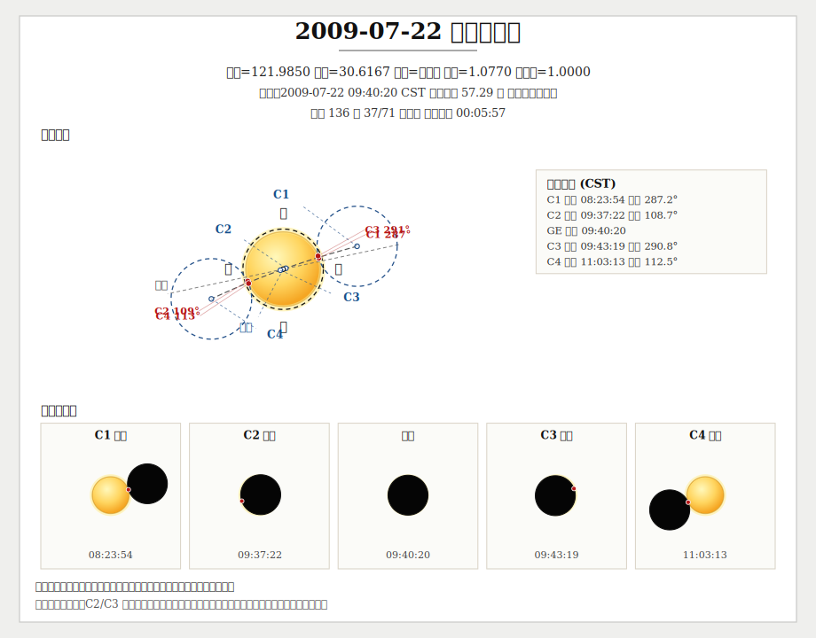
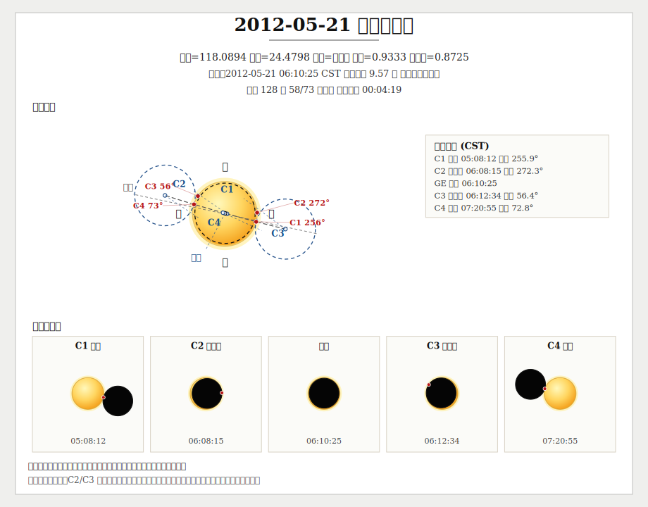
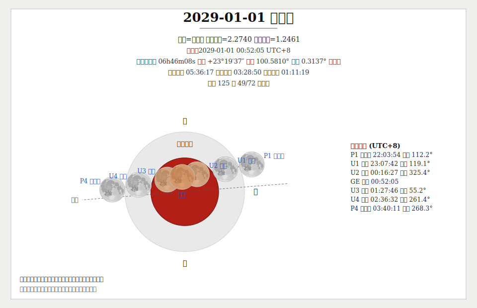

# Astro

**[English](README.en.md) | 中文**

[](https://pkg.go.dev/github.com/starainrt/astro)

自用多年的天文算法库，用于个人天文历法爱好、科普演示和轻量研究。

>📚 本项目主要用于天文算法学习与验证，计算结果满足业余爱好级别需求。

基于《天文算法》（Astronomical Algorithms）一书实现，提供历法转换、太阳/月亮/行星位置、日月食、升落、中天、月相、恒星、坐标变换、物理星历、研究公式和通用小天体轨道传播等功能。太阳和行星部分使用内置 VSOP87 解析项，月球部分使用内置 ELP2000/82 解析级数，不依赖外部 JPL 星历文件。

没有特殊标注时，本程序所提供的坐标均为瞬时天球坐标；角度单位默认是度，视直径/视半径单位是角秒，距离单位按函数名使用 AU 或 km。


## 目录

- [安装](#安装)
- [功能概览](#功能概览)
- [包概览](#包概览)
- [适用范围与精度](#适用范围与精度)
- [快速开始](#快速开始)
   - [历法转换与节气](#历法转换与节气)
   - [太阳与月亮](#太阳与月亮)
   - [Lite 轻量太阳与月亮](#lite-轻量太阳与月亮)
   - [行星](#行星)
   - [恒星](#恒星)
   - [坐标工具](#坐标工具)
   - [研究公式](#研究公式)
   - [通用小天体轨道](#通用小天体轨道)
   - [日晷与真太阳时](#日晷与真太阳时)
- [TODO](#todo)

## 安装

```bash
go get github.com/starainrt/astro
```

## 功能概览

- 📅 **历法转换**：公历与农历互转（公元前721年-公元3000年或更久）、节气时刻
- 🌞 **太阳计算**：天球位置、日出日落、日地距离、真太阳时、视高度角、视差角、日面物理参数（`P/B0/L0`）、视直径等
- 🌙 **月亮计算**：天球位置、月出月落、地月距离、月相、朔望时间、视直径、亮边位置角、视差角、地心/站心天平动、近远地点、交点、最大赤纬等
- 🪶 **轻量链路**：`lite/sun` 与 `lite/moon` 提供面向手表、前端、小程序和其它资源受限环境的轻量近似太阳/月亮算法，覆盖天球位置、升落和月相
- 🌗 **日月食**：全局日食、站心日食、中心线/偏食足迹、月食、地方可见月食与 SVG 示意图
- 🪐 **行星计算**：七大行星天球位置、升落时间、合冲留、大距、水星/金星地心凌日等特殊天象时间、升交点/降交点、视直径/视半径、相位、视差角、节点、视星等与物理星历
- ⭐ **恒星计算**：指定天球坐标所属星座；同时包含9100颗恒星数据库，可计算升降时间、视差角和视高度角，获取指定日期的恒星坐标信息
- 🧭 **坐标工具**：黄道/赤道/地平坐标转换、站心坐标、恒星时、岁差、章动、角距离、大气折射、大气质量、视差角、银道坐标
- 🔭 **研究公式**：黑体辐射、会合周期、星等距离换算、望远镜极限星等、恒星半径/温度/光度换算、大气质量模型
- ☄️ **通用轨道**：给定小行星、彗星或假想天体轨道根数，计算日心/地心位置和站心视位置，并提供距日/距地距离、日距角、相位角、照明比例、H-G 视星等和轻量视双星位置角/角距计算
- 🕰️ **日晷**：真/平太阳时换算、太阳时角、平太阳时/区时时角、平面日晷几何、赤道/水平/垂直日晷特例

## 包概览

| 包 | 主要能力 |
| --- | --- |
| `calendar` | 公历/农历互转、节气、历史朝代年号、古代历法信息 |
| `coord` | 黄道/赤道/地平互转、恒星时、岁差、章动、站心坐标、大气折射、大气质量、视差角、银道坐标、手动黄赤交角和手动时角的研究接口 |
| `sun` | 太阳位置、日出日落、晨昏朦影、均时差、真太阳时、视高度角、视差角、视直径、日面 `P/B0/L0` |
| `moon` | 月亮位置、月出月落、月相、朔望弦、视高度角、视差角、视直径、亮边位置角、地心/站心天平动、近远地点、交点、最大赤纬 |
| `lite/sun` / `lite/moon` | 轻量太阳/月亮近似链路，面向分钟级升落、轻量天球位置和月相计算 |
| `eclipse` / `eclipse/svg` | 全局/局地日月食、日食中心线与偏食足迹、局地可见性筛选、日月食 SVG |
| `mercury` / `venus` | 水星、金星位置、升落、合日、留、大距、地心凌日、相位、视差角、视星等、视直径、节点和物理星历 |
| `mars` / `jupiter` / `saturn` / `uranus` / `neptune` | 外行星位置、升落、合冲、留、方照、相位、视差角、视星等、视直径、节点和物理星历 |
| `earth` | 地球轨道偏心率、近日点、远日点 |
| `star` | 星座判定、恒星数据库、恒星自行/岁差/章动修正、恒星升落、视差角、视高度角 |
| `formula` | 与具体日期无关的常用研究公式和天文奥赛公式，含大气质量模型 |
| `orbit` | 通用日心二体圆锥曲线轨道传播，支持椭圆、近抛物、抛物和双曲轨道；另含相位/测光辅助和轻量视双星计算 |
| `sundial` | 真/平太阳时换算、太阳时角、平太阳时/区时时角、平面日晷几何、时间线/赤纬曲线采样、赤道/水平/垂直日晷特例 |

很多接口额外提供 `...N` 截断版本：

- `n < 0`：使用本仓库当前内置的全部解析项
- `n >= 0`：截断解析项，适合性能对比、粗算或算法研究

这里的“全部解析项”指package中已经内置的表项，不等同于外部发行版 VSOP/ELP 长表的全部原始数据。

大气质量接口的补充：

- `coord.Airmass...` 面向观测场景，既可以直接传入视高度角，也可以从真高度角先做折射修正再计算
- `formula.Airmass...` 只提供纯公式本身，不负责折射修正，适合已经在别处拿到视高度角或天顶距时直接调用

## 适用范围与精度

### 太阳与行星

太阳和行星使用内置 VSOP87 解析项，当前表项覆盖 **J2000 前后约 4000 年**。精度量级如下：

| 目标 | 黄经/黄纬 | 距离 |
| --- | --- | --- |
| 太阳/地球 | 约 `0.1"` | 约 `0.1 × 10^-6 AU` |
| 水星、金星 | 约 `0.2"` | 约 `0.2 × 10^-6 AU` |
| 火星 | 约 `0.5"` | 约 `1 × 10^-6 AU` |
| 木星 | 约 `0.5"` | 约 `3 × 10^-6 AU` |
| 土星 | 约 `0.5"` | 约 `5 × 10^-6 AU` |
| 天王星 | 约 `1"` | 约 `20 × 10^-6 AU` |
| 海王星 | 约 `1"` | 约 `40 × 10^-6 AU` |

这类精度适合常规天文历法、观测辅助、科普展示和个人研究。如果需要航天导航、掩星预报或严格动力学积分，应使用 JPL DE 等专业星历。

### 月球

月球使用内置的 ELP/MPP02 DE405 解析级数（截断版，保留主要周期项），库体积轻，不需要外部星历文件。它适合农历定朔、月相、升落、月食和常规位置计算；若需要极高精度月球测距、长期物理天平动或专业掩星，请以 JPL 星历或专门月球星历为准。

### Lite 轻量链路

`lite/sun` 和 `lite/moon` 是独立于 `sun` / `moon` 的近似实现。不依赖 VSOP87 或 ELP2000/82，适合 CPU / 内存受限环境。

- `lite/sun`：简化太阳真黄经 / 视黄经公式 + 轻量赤道坐标转换
- `lite/moon`：Schlyter 风格月球近似（约 15 个摄动项）+ 轻量站心修正
- 升落搜索：固定步长扫描 + 二分，不走主链的高精度章动迭代
- 计算链路零堆分配（0 allocs/op），月球位置约 1µs，比主链快 20–60 倍

能力边界：

| 包 | 位置模型 | 升落搜索 | 主要用途 |
| --- | --- | --- | --- |
| `lite/sun` | 简化太阳真/视黄经 + 轻量赤道坐标转换 | `30` 分钟步长扫描 + 二分 | 日出日落、太阳高度角、表盘/前端周期刷新 |
| `lite/moon` | Schlyter / vFPS 月球近似 + 轻量站心修正 | `15` 分钟步长扫描 + 二分 | 月出月落、月相、月龄、轻量月球观测辅助 |

与主链 `sun` / `moon` 的误差（2026 全年，8 个站点；升落每 7 或 15 天取样，月相月龄每 6 小时）：

| 能力 | 平均绝对误差 | P95 | 最大绝对误差 | 备注 |
| --- | --- | --- | --- | --- |
| `lite/sun` 日出 | `0.02 min` | `0.04 min` | `0.31 min` | 样本中无事件存在性分歧 |
| `lite/sun` 日落 | `0.02 min` | `0.06 min` | `0.35 min` | `2` 个高纬样本在跨午夜“归属哪一天”上有语义差异 |
| `lite/moon` 月出 | `0.28 min` | `0.57 min` | `1.44 min` | 样本中无事件存在性分歧 |
| `lite/moon` 月落 | `0.36 min` | `0.86 min` | `1.24 min` | `1` 个高纬样本在“当天是否有月落”上与主链判断不同 |
| `lite/moon` `Phase()` | `0.00089` | `0.00185` | `0.00243` | 和 `moon.Phase` 对比 |
| `lite/moon` `PhaseAge()` | `0.003 d` | `0.010 d` | `0.014 d` | 约平均 4.3 分钟、P95 14.4 分钟、最大 20.2 分钟 |
| `lite/moon` 地心黄经 | `2.41'` | `6.82'` | `9.91'` | 相对主链月球位置 |
| `lite/moon` 地心黄纬 | `0.87'` | `1.83'` | `2.92'` | 相对主链月球位置 |

本地 `Go testing.Benchmark` 参考值（绝对值因机器而异，相对趋势稳定）：

| 接口 | 主链 | `lite` | 加速倍数 | 主链分配 | `lite` 分配 |
| --- | --- | --- | --- | --- | --- |
| `Sun ApparentRaDec` | `13.392 µs/op` | `231.0 ns/op` | `57.97x` | `0 B/op, 0 allocs/op` | `0 B/op, 0 allocs/op` |
| `Sun Altitude` | `16.405 µs/op` | `681.5 ns/op` | `24.09x` | `0 B/op, 0 allocs/op` | `0 B/op, 0 allocs/op` |
| `Sun RiseTime` | `202.994 µs/op` | `18.823 µs/op` | `10.78x` | `0 B/op, 0 allocs/op` | `0 B/op, 0 allocs/op` |
| `Moon ApparentRaDec` | `65.273 µs/op` | `1.035 µs/op` | `63.06x` | `297202 B/op, 70 allocs/op` | `0 B/op, 0 allocs/op` |
| `Moon Phase` | `40.264 µs/op` | `940.6 ns/op` | `42.83x` | `178321 B/op, 42 allocs/op` | `0 B/op, 0 allocs/op` |
| `Moon Altitude` | `44.883 µs/op` | `2.275 µs/op` | `19.73x` | `178321 B/op, 42 allocs/op` | `0 B/op, 0 allocs/op` |
| `Moon RiseTime` | `659.886 µs/op` | `77.600 µs/op` | `8.50x` | `2377613 B/op, 560 allocs/op` | `0 B/op, 0 allocs/op` |

需要日月食、物理天平动或高纬边界判定时，仍用主链 `sun` / `moon`。

### 精度校验参考

下面这些函数曾与 JPL Horizons、NASA GSFC 等资料对照，可作为使用时判断结果量级的参考：

- 太阳/行星/月亮视直径：与外部基线最大差异从 `0.000002"` 到 `0.194598"` 不等，月亮因视差和距离变化更敏感
- 太阳物理星历 `P/B0/L0`：最大差异约 `0.003349° / 0.003986° / 0.047394°`
- 行星升/中天/落：已用 JPL Horizons 电视事件（TVH, Time-Varying Hourly）做对比校验；该基线按 1 分钟步长生成，当前结果与 Horizons 事件时间在分钟级上对齐
- 地球近日点/远日点：时刻最大差异约 `1m28.84s`，距离最大差异约 `0.000000039837 AU`
- 月球主链位置：当前算法为 ELP/MPP02 DE405 解析级数截断版；在 `-2000` 年四个 JPL/Horizons `JDTT` 样本上，相对 JPL/Horizons 的最大差异约为黄经 `219.6"`、黄纬 `25.8"`、距离 `34.3 km`
- 月球近地点/远地点：时刻最大差异约 `15m53.45s`，距离最大差异约 `39.758 km`
- 月球最大赤纬：时刻最大差异约 `2.43s`，赤纬最大差异约 `0.00006431°`

## 快速开始

### 历法转换与节气

本 package 支持公历与中国传统农历日期之间的相互转换，并提供节气信息。支持年份范围为公元前721年至公元3000年（部分现代算法可更久）。
农历本质上是阴阳合历（Lunisolar Calendar），但为兼顾大众习惯与代码简洁性，相关函数命名采用 `Lunar` 而非更学术的 `Lunisolar`。

#### 历法说明

- **默认路由**：按年份自动选择，先秦段使用春秋/古六历重建，`-220..-104` 使用秦汉颛顼历，`-103..1912` 使用历表，`1913` 年后使用现代算法。
- **显式古历**：如果需要指定某一古历系统，请使用 `SolarToLunarWithCalendar` / `LunarToSolarWithCalendar` 这类 API。
- **数据来源**：古历部分主要参考《寿星天文历》；使用 [ytliu0教授的网站数据](https://ytliu0.github.io/ChineseCalendar/index_simp.html)做验证；现代段依据GB/T 33661-2017编排，通过 VSOP87、ELP定气定朔 。
- **节气**：`JieQi` 返回现代天文计算的节气时刻；`CalendricalJieQi` 返回历法相符节气日期。

---

#### 使用须知

##### 1. 同一公历日期可能对应多个农历日期
在多个政权并存的历史时期（如三国时期），不同政权可能使用不同历法，造成同一公历日期对应多个农历日期。本程序尽可能提供所有可能的转换结果。

##### 2. 同一农历日期可能对应多个公历日期
不仅因多个政权历法不同，同一政权在历法改革中也可能出现此类情况。例如，武则天改历后，圣历三年出现了两个腊月。

##### 3. 公历历法处理规则
本程序基于儒略日进行计算，公历部分处理规则如下：
- 1582年10月15日之后：使用格里高利历
- 1582年10月4日之前：使用儒略历
- 公元8年之前：使用逆推儒略历
- 1582年10月4日的下一天为1582年10月15日
- 1582年10月5日到10月14日这10个公历日期不存在，相关接口会直接拒绝
- 年份表示：0年表示公元前1年，-1年表示公元前2年，以此类推

##### 4. 时区说明

本 package 主要面向中国历法，因此定气和定朔的计算默认采用北京时间（UTC+8）。对于使用其他时区的地区，若直接套用中国农历的编排规则，可能会产生日期偏差。

为方便探索与研究，本 package 提供了底层方法 `Solar` 和 `Lunar`，它们支持在**自定义时区**下，按照**现行中国农历算法（GB/T 33661-2017）**进行公历与农历的相互转换。
如果只需北京时间下的标准转换，请直接使用封装好的 `SolarToLunar` 和 `LunarToSolar` 方法。

**示例**：农历规则要求冬至必须落在农历十一月。以1984年冬至为例，计算可得：
```go
ws := calendar.JieQi(1984, 270)
fmt.Println(ws)
fmt.Println(moon.ClosestShuoYue(ws))
```

| 节令 | 东八区 (UTC+8) | 东七区 (UTC+7) |
|------|----------------|----------------|
| 冬至 | 1984-12-22     | 1984-12-21     |
| 朔日 | 1984-12-22     | 1984-12-22     |

可见，对于东八区（中国），1984年12月22日既是冬至又是朔日，因此该日为农历十一月初一；而在东七区，冬至提前至12月21日，导致12月22日已成为腊月初一。

类似地，春节的日期也会相差一天。1985年正月初一对应的公历日期，在东八区为2月20日，在东七区则为1月21日：
```go
fmt.Println(calendar.Solar(1985, 1, 1, false, 8.0))
fmt.Println(calendar.Solar(1985, 1, 1, false, 7.0))
```

##### 5. Go 语言特别注意

⚠️ **Go 标准库 `time.Time` 在历法处理上与本程序存在差异：**

- Go 语言在1582年10月15日之前使用逆推格里高利历，而非儒略历。若不使用 `Add` 方法，一般可正常使用。
- 因此，**在1582年10月15日之前，`time.Time.Weekday()` 返回结果与本程序计算结果不一致**。
  例如：1582年10月4日，本程序为星期四，Go 语言判断为星期一。

#### 建议解决方案：
如需获得与本程序一致的星期数，可使用如下方法：

```go
// date 应为当日0时的 time.Time
weekday := int(calendar.Date2JDE(date)+1.5) % 7
// 0表示星期日，1表示星期一，……，6表示星期六
```
若在1582年之前使用 time.Time 的 Add 或 AddDate 方法，请注意其在某些年份可能不准确。
例如：700年儒略历为闰年，而 Go 使用的逆推格里高利历中700年不是闰年。

#### 历法转换

##### 公历转农历

- **输入**：公历日期 (`time.Time`)
- **输出**：`calendar.Time` 对象，可能包含多个对应的农历日期
- **功能**：可从返回对象中获取：
   - 农历日期的详细描述
   - 年、月、日的天干地支
   - 所属朝代、皇帝、年号等信息
   - 完整的结构化农历信息

##### 农历转公历

支持两种调用方式：

###### 方式一：传入农历字符串
支持以下格式（示例）：
1. `年号+年+月+日`：如 **`"元丰六年十月十二"`**（闰月前加"闰"，日期格式为"初一"、"二十"等）
2. `年号+年+月+干支日`：如 **`"元嘉二十七年七月庚午"`**
3. `年份+月+日`：如 **`"二零二五年正月初一"`**（闰月前加"闰"，适用于现代日期）
4. `年份+月+干支日`：如 **`"二零二五年正月戊戌日"`**
5. `阿拉伯数字+月+日`：可以将中文数字替换为阿拉伯数字，如 **`"2025年1月1日"`**，代表`二零二五年正月初一`
6. **注意历史场景**：历史上月份名称可能与现代不同（如武则天时期“正月”与“一月”代表不同月份），请使用汉字数字确保准确性

> ⚠️ **特别提醒**：
> 农历年份与公历年份并非完全重合。例如：公历2025年1月28日（除夕）对应农历2024年腊月二十九，应传入 `"二零二四年腊月廿九"`。

###### 方式二：传入数字参数
- **参数**：年份 (`int`)、月份 (`int`)、日期 (`int`)、是否闰月 (`bool`)
- **特点**：简单直接，适用于现代农历日期转换

##### 代码示例

```go
package main

import (
   "encoding/json"
   "fmt"
   "github.com/starainrt/astro/calendar"
   "time"
)

func main() {
   cst := time.FixedZone("CST", 8*3600)

   // 示例1：公历转农历；这里故意选三国时期，会返回多个政权并行历法结果。
   date := time.Date(240, 1, 1, 8, 8, 8, 8, cst)
   lunar, _ := calendar.SolarToLunar(date)
   fmt.Println(lunar.LunarDescWithEmperor())

   info := lunar.LunarInfo()
   data, _ := json.MarshalIndent(info, "", "  ")
   fmt.Println(string(data))

   // 示例2：农历转公历（字符串格式）；这里用苏轼《记承天寺夜游》的日期。
   solar, _ := calendar.LunarToSolar("元丰六年十月十二日")
   for _, v := range solar {
      fmt.Println(v.Time())
      fmt.Println(v.LunarDescWithEmperor())
   }

   // 示例3：农历转公历（数字参数格式）；2026 年正月初一，也就是春节。
   modernDate, _ := calendar.LunarToSolarByYMD(2026, 1, 1, false)
   fmt.Println(modernDate.Time())
}
```

输出结果：

```text
// 同一公历时刻在三国并立时期会映射到多个政权各自的农历结果
[魏明帝 景初三年腊月二十 蜀后主 延熙二年冬月十九 吴大帝 赤乌二年冬月二十]
// 结构化农历信息输出；每个对象对应一个政权口径下的结果
[
  {
    "solarDate": "0240-01-01T08:08:08.000000008+08:00",
    "lunarYear": 239,
    "lunarYearChn": "二三九",
    "lunarMonth": 12,
    "lunarDay": 20,
    "isLeap": false,
    "lunarMonthDayDesc": "腊月二十",
    "ganzhiYear": "己未",
    "ganzhiMonth": "丙子",
    "ganzhiDay": "辛未",
    "dynasty": "魏",
    "emperor": "魏明帝",
    "nianhao": "景初",
    "yearOfNianhao": 3,
    "eraDesc": "景初三年",
    "lunarWithNianhaoDesc": "景初三年腊月二十",
    "chineseZodiac": "羊"
  },
  {
    "solarDate": "0240-01-01T08:08:08.000000008+08:00",
    "lunarYear": 239,
    "lunarYearChn": "二三九",
    "lunarMonth": 11,
    "lunarDay": 19,
    "isLeap": false,
    "lunarMonthDayDesc": "冬月十九",
    "ganzhiYear": "己未",
    "ganzhiMonth": "丙子",
    "ganzhiDay": "辛未",
    "dynasty": "",
    "emperor": "蜀后主",
    "nianhao": "延熙",
    "yearOfNianhao": 2,
    "eraDesc": "延熙二年",
    "lunarWithNianhaoDesc": "延熙二年冬月十九",
    "chineseZodiac": "羊"
  },
  {
    "solarDate": "0240-01-01T08:08:08.000000008+08:00",
    "lunarYear": 239,
    "lunarYearChn": "二三九",
    "lunarMonth": 11,
    "lunarDay": 20,
    "isLeap": false,
    "lunarMonthDayDesc": "冬月二十",
    "ganzhiYear": "己未",
    "ganzhiMonth": "丙子",
    "ganzhiDay": "辛未",
    "dynasty": "吴",
    "emperor": "吴大帝",
    "nianhao": "赤乌",
    "yearOfNianhao": 2,
    "eraDesc": "赤乌二年",
    "lunarWithNianhaoDesc": "赤乌二年冬月二十",
    "chineseZodiac": "羊"
  }
]
// “元丰六年十月十二日”对应的公历日期
1083-11-24 00:00:00 +0800 CST
// 同一天在并行政权下还会命中辽道宗大康九年十月十二
[宋神宗 元丰六年十月十二 辽道宗 大康九年十月十二]
// 现代农历日期转换结果；2026 年正月初一对应 2026-02-17
2026-02-17 00:00:00 +0800 CST
```

#### 节气

`JieQi(year, term)` 返回现代天文算法计算出的节气精确时刻；`CalendricalJieQi(year, term)` 返回默认历法下节气落在的日期，时间固定为北京时间当天 0 点。需要指定古历系统时，使用 `CalendricalJieQiWithCalendar(year, term, system)`。

```go
package main

import (
	"fmt"

	"github.com/starainrt/astro/calendar"
)

func main() {
	// 计算 2020 年立春时刻；节气常量本质上对应太阳视黄经。
	fmt.Println(calendar.JieQi(2020, calendar.JQ_立春))
	// 计算 2020 年冬至时刻。
	fmt.Println(calendar.JieQi(2020, calendar.JQ_冬至))
	// 计算 2020 年春分时刻。
	fmt.Println(calendar.JieQi(2020, calendar.JQ_春分))
	// 也可直接传入黄经数值；春分对应太阳视黄经 0°。
	fmt.Println(calendar.JieQi(2020, 0))
}
```

输出结果

```
2020-02-04 17:03:20.471614301 +0800 CST
2020-12-21 18:02:20.648710727 +0800 CST
2020-03-20 11:49:37.149532735 +0800 CST
2020-03-20 11:49:37.149532735 +0800 CST

```

历法相符节气示例：

```go
date, err := calendar.CalendricalJieQi(1582, calendar.JQ_冬至)
fmt.Println(date, err)

date, err = calendar.CalendricalJieQiWithCalendar(-202, calendar.JQ_冬至, calendar.AncientCalendarQinHan)
fmt.Printf("%d-%02d-%02d %v\n", date.Year(), int(date.Month()), date.Day(), err)
```

输出结果

```
1582-12-22 00:00:00 +0800 CST <nil>
-202-12-25 <nil>
```


### 太阳与月亮

#### 观测角语义

- `Altitude`：高度角，地平线为 `0°`，天顶为 `+90°`
- `Zenith`：天顶距，天顶为 `0°`，地平线为 `90°`
- **注意：旧版本中 `Zenith` 曾错误返回高度角；当前版本已修正，升级时请重点检查调用方**

#### 日出日落/月出月落

> ⚠️ **重要说明**：
> 月球升降时间计算基于当天日期，升降时间点之间不一定具有连续性。
>
> **可能出现的情况**：
> - 月亮可能在凌晨1点落下，中午12点再次升起，此时升起时间会晚于降落时间；要获取此场景晚上的月落时间，需要传入次日日期进行计算
>
> **如需获取完整升降周期，需要自行通过判断升起时间是否在降落时间之后来确定后续的正确时间点**

```go
package main

import (
	"fmt"
	"github.com/starainrt/astro/moon"
	"github.com/starainrt/astro/sun"
	"time"
)

func main() {
	// 以陕西省西安市为例，设置西安市经纬度,设置地平高度为0米
	var lon, lat, height float64 = 108.93, 34.27, 0
	cst := time.FixedZone("CST", 8*3600)
	// 指定 2020-01-01 08:08:08 CST，所有"今日"语义都以这个本地自然日为基准。
	date := time.Date(2020, 1, 1, 8, 8, 8, 8, cst)
	// 西安市2020年1月1日民用晨朦影开始时间
	// 民用朦影，太阳位于地平线下6度，航海朦影=地平线下12度，天文朦影=地平线下18度
	fmt.Println(sun.MorningTwilight(date, lon, lat, -6))
	// 西安市2020年1月1日日出时间，计算大气影响
	fmt.Println(sun.RiseTime(date, lon, lat, height, true))
	// 西安市2020年1月1日太阳上中天时间
	fmt.Println(sun.CulminationTime(date, lon))
	// 西安市2020年1月1日日落时间，计算大气影响
	fmt.Println(sun.SetTime(date, lon, lat, height, true))
	// 西安市2020年1月1日民用昏朦影结束时间
	fmt.Println(sun.EveningTwilight(date, lon, lat, -6))

	// 西安市2020年1月1日月出时间，计算大气影响
	fmt.Println(moon.RiseTime(date, lon, lat, height, true))
	// 西安市2020年1月1日月亮上中天时间
	fmt.Println(moon.CulminationTime(date, lon, lat))
	// 西安市2020年1月1日月落时间，计算大气影响
	fmt.Println(moon.SetTime(date, lon, lat, height, true))
}
```


输出结果

```
2020-01-01 07:22:27.960488498 +0800 CST <nil>
2020-01-01 07:50:14.530648291 +0800 CST <nil>
2020-01-01 12:47:35.933117866 +0800 CST
2020-01-01 17:44:47.070974707 +0800 CST <nil>
2020-01-01 18:12:33.624035418 +0800 CST <nil>
2020-01-01 11:52:45.157297253 +0800 CST <nil>
2020-01-01 17:38:02.510787248 +0800 CST
2020-01-01 23:26:51.580328643 +0800 CST <nil>


```

#### 日月位置


```go
package main

import (
	"fmt"
	"github.com/starainrt/astro/moon"
	"github.com/starainrt/astro/star"
	"github.com/starainrt/astro/sun"
	"github.com/starainrt/astro/tools"
	"time"
)

func main() {
	// 以陕西省西安市为例，设置西安市经纬度,设置地平高度为0米
	var lon, lat float64 = 108.93, 34.27
	cst := time.FixedZone("CST", 8*3600)
	// 指定观测时刻。
	date := time.Date(2020, 1, 1, 8, 8, 8, 8, cst)
	// 太阳此刻的视黄经，单位度。
	fmt.Println(sun.ApparentLo(date))
	// 此刻黄赤交角，第二个参数 true 表示使用真黄赤交角。
	fmt.Println(sun.EclipticObliquity(date, true))
	//太阳此刻视赤经、视赤纬
	ra, dec := sun.ApparentRaDec(date)
	fmt.Println("赤经：", tools.Format(ra/15, 1), "赤纬：", tools.Format(dec, 0))
	//太阳当前所在星座
	fmt.Println(star.Constellation(ra, dec, date))
	//此刻西安市的太阳方位角、高度角、天顶距
	fmt.Println("方位角：", sun.Azimuth(date, lon, lat), "高度角：", sun.Altitude(date, lon, lat), "天顶距：", sun.Zenith(date, lon, lat))
	//此刻日地距离，单位为天文单位（AU）
	fmt.Println(sun.EarthDistance(date))

	//月亮此刻站心视赤经、视赤纬
	ra, dec = moon.ApparentRaDec(date, lon, lat)
	fmt.Println("赤经：", tools.Format(ra/15, 1), "赤纬：", tools.Format(dec, 0))
	//月亮当前所在星座
	fmt.Println(star.Constellation(ra, dec, date))
	//此刻西安市的月亮方位角、高度角、天顶距
	fmt.Println("方位角：", moon.Azimuth(date, lon, lat), "高度角：", moon.Altitude(date, lon, lat), "天顶距：", moon.Zenith(date, lon, lat))
	//此刻地月距离，单位为千米
	fmt.Println(moon.EarthDistance(date))
}
```

输出结果：

```
280.01526210031136
23.4362178391013
赤经： 18h43m34.82s 赤纬： -23°3′30.27″
人马座
方位角： 120.19477090015224 高度角： 2.4014437419430097 天顶距： 87.59855625805699
0.983292937163176
赤经： 23h17m53.15s 赤纬： -10°19′18.57″
宝瓶座
方位角： 67.84050700509859 高度角： -45.13425530765482 天顶距： 135.13425530765483
404238.6096080479
```

太阳还提供 `sun.Physical` / `sun.PhysicalN`，返回：

- `P`：太阳北极位置角，单位度
- `B0`：日面中心太阳纬度，单位度
- `L0`：日面中心卡林顿经度，单位度

日月与七大行星还提供统一的 `Diameter` / `Semidiameter`（以及 `N` 版），单位均为角秒：

```go
fmt.Println(sun.Diameter(date), sun.Semidiameter(date))
fmt.Println(sun.Physical(date))
fmt.Println(moon.Diameter(date), moon.Semidiameter(date))
fmt.Println(mars.Diameter(date), mars.Semidiameter(date))
```

地球和月球还提供轨道距离极值、月球最大赤纬和月球物理观测参数：

```go
package main

import (
	"fmt"
	"time"

	"github.com/starainrt/astro/earth"
	"github.com/starainrt/astro/moon"
)

func main() {
	// 2026 年地球近日点、远日点，时间为 UTC，距离单位 AU。
	peri := earth.Perihelion(2026)
	aphe := earth.Aphelion(2026)
	fmt.Printf("earth perihelion=%s distance=%.9fAU\n", peri.Time.Format(time.RFC3339), peri.Distance)
	fmt.Printf("earth aphelion=%s distance=%.9fAU\n", aphe.Time.Format(time.RFC3339), aphe.Distance)

	// 2026 年 1 月的月球近地点、远地点，距离单位 km。
	perigees := moon.PerigeesInMonth(2026, time.January)
	apogees := moon.ApogeesInMonth(2026, time.January)
	fmt.Printf("moon perigee=%s distance=%.1fkm count=%d\n", perigees[0].Time.Format(time.RFC3339), perigees[0].Distance, len(perigees))
	fmt.Printf("moon apogee=%s distance=%.1fkm count=%d\n", apogees[0].Time.Format(time.RFC3339), apogees[0].Distance, len(apogees))

	// 2026 年 1 月的月球最大北/南赤纬。
	north := moon.MaximumNorthDeclinationsInMonth(2026, time.January)
	south := moon.MaximumSouthDeclinationsInMonth(2026, time.January)
	fmt.Printf("north=%s dec=%.6f\n", north[0].Time.Format(time.RFC3339), north[0].Declination)
	fmt.Printf("south=%s dec=%.6f\n", south[0].Time.Format(time.RFC3339), south[0].Declination)

	// 月球天平动和自转轴位置角。
	physical := moon.Physical(time.Date(2026, 1, 1, 0, 0, 0, 0, time.UTC))
	fmt.Printf("libration lon=%.6f lat=%.6f pa=%.6f\n", physical.LibrationLongitude, physical.LibrationLatitude, physical.PositionAngle)

	// 月亮明亮边缘位置角；0° 从月面北点起，向东增加。
	fmt.Printf("bright limb=%.6f\n", moon.BrightLimbPositionAngle(time.Date(2026, 1, 1, 0, 0, 0, 0, time.UTC)))

	// 上海站心看到的月球天平动、自转轴位置角和亮边位置角。
	topo := moon.TopocentricPhysical(time.Date(2026, 1, 1, 0, 0, 0, 0, time.UTC), 121.4737, 31.2304, 4)
	fmt.Printf("topo libration lon=%.6f lat=%.6f pa=%.6f\n", topo.LibrationLongitude, topo.LibrationLatitude, topo.PositionAngle)
	fmt.Printf("topo bright limb=%.6f\n", moon.TopocentricBrightLimbPositionAngle(time.Date(2026, 1, 1, 0, 0, 0, 0, time.UTC), 121.4737, 31.2304, 4))
}
```

输出结果：

```text
earth perihelion=2026-01-03T17:15:35Z distance=0.983302050AU
earth aphelion=2026-07-06T17:31:24Z distance=1.016643936AU
moon perigee=2026-01-01T21:44:24Z distance=360348.1km count=2
moon apogee=2026-01-13T20:47:13Z distance=405437.9km count=1
north=2026-01-02T08:10:49Z dec=28.266373
south=2026-01-16T05:15:14Z dec=-28.304184
libration lon=-1.278902 lat=-6.531444 pa=-9.967050
bright limb=267.364849
topo libration lon=-2.010562 lat=-5.912181 pa=-10.184664
topo bright limb=266.045494
```

如果只关心某一时刻地球轨道偏心率，也可以直接调用：

```go
fmt.Printf("earth e=%.9f\n", earth.EarthEccentricity(time.Date(2026, 1, 1, 0, 0, 0, 0, time.UTC)))
```

月球也提供升交点和降交点黄经，适合做食季、轨道几何和月球轨道研究：

```go
nodeDate := time.Date(2026, 1, 1, 0, 0, 0, 0, time.UTC)
fmt.Println(moon.AscendingNode(nodeDate), moon.DescendingNode(nodeDate))
```

这里的“升交点 / 降交点”与行星章节中的定义相同：

- `AscendingNode`：月球轨道从黄道南侧穿到黄道北侧时的黄经
- `DescendingNode`：月球轨道从黄道北侧穿到黄道南侧时的黄经
- 单位都是度；同一时刻两者通常相差约 `180°`

以上面 `nodeDate := 2026-01-01 00:00:00 UTC` 的示例来说，输出结果是：

```text
340.9570862454423 160.95708624544227
```

#### 月相

```go
package main

import (
	"fmt"
	"github.com/starainrt/astro/moon"
	"time"
)

func main() {
	cst := time.FixedZone("CST", 8*3600)
	// 指定观测时刻。
	date := time.Date(2020, 1, 1, 8, 8, 8, 8, cst)
	//月亮此刻被照亮的比例（月相）
	fmt.Println(moon.Phase(date))
	//月相具体描述
	fmt.Println(moon.PhaseDesc(date))
	//下次朔月时间；也可用 moon.NextNewMoon(date)
	fmt.Println(moon.NextShuoYue(date))
	//下次上弦月时间；也可用 moon.NextFirstQuarter(date)
	fmt.Println(moon.NextShangXianYue(date))
	//下次望月时间；也可用 moon.NextFullMoon(date)
	fmt.Println(moon.NextWangYue(date))
	//下次下弦月时间；也可用 moon.NextLastQuarter(date)
	fmt.Println(moon.NextXiaXianYue(date))
}
```

输出结果：

```
0.300041309608744 // 月面约有 30% 被太阳照亮
上峨眉月 // 当前月相描述
2020-01-25 05:41:58.271192908 +0800 CST // 下一次朔月
2020-01-03 12:45:23.229190707 +0800 CST // 下一次上弦
2020-01-11 03:21:17.159625291 +0800 CST // 下一次望月，也就是满月
2020-01-17 20:58:23.396406769 +0800 CST // 下一次下弦
```

月相四个相位同时提供拼音名和英文 alias，例如：

- `ShuoYue` / `NewMoon`
- `WangYue` / `FullMoon`
- `ShangXianYue` / `FirstQuarter`
- `XiaXianYue` / `LastQuarter`

对应的 `Next*`、`Last*`、`Closest*` 也都成组提供。

#### Lite 轻量太阳与月亮

`lite/sun` 和 `lite/moon` 的用法与主链相同。误差量级见[适用范围与精度](#lite-轻量链路)。

```go
package main

import (
	"fmt"
	litemoon "github.com/starainrt/astro/lite/moon"
	litesun "github.com/starainrt/astro/lite/sun"
	"time"
)

func main() {
	cst := time.FixedZone("CST", 8*3600)
	date := time.Date(2026, 1, 1, 20, 0, 0, 0, cst)

	fmt.Println(litesun.Altitude(date, 121.4737, 31.2304))
	fmt.Println(litesun.RiseTime(date, 121.4737, 31.2304, 0, true))

	fmt.Println(litemoon.Phase(date))
	fmt.Println(litemoon.PhaseAge(date))
	fmt.Println(litemoon.RiseTime(date, 121.4737, 31.2304, 0, true))
}
```

导出函数：

- `lite/sun`：`TrueLo`、`ApparentLo`、`Distance`、`TrueRaDec`、`ApparentRaDec`、`HourAngle`、`Azimuth`、`Altitude`、`Zenith`、`RiseTime`、`SetTime`
- `lite/moon`：`TrueLo`、`TrueBo`、`TrueRaDec`、`ApparentRaDec`、`HourAngle`、`Azimuth`、`Altitude`、`Zenith`、`SunMoonLoDiff`、`Phase`、`PhaseAge`、`RiseTime`、`SetTime`

#### 日食

日食计算统一放在 `eclipse` 包；SVG 生成功能放在 `eclipse/svg` 包。默认采用 `NASA bulletin Split-K` 的月亮半径口径；如果需要 IAU 单一 `k` 值，也可以调用同名的 `...IAUSingleK` 接口。

常用接口：

- `SolarEclipseOnDate`：判断某个当地日期附近是否有全局日食
- `LastSolarEclipse` / `NextSolarEclipse` / `ClosestSolarEclipse`：搜索全局日食
- `LocalSolarEclipseOnDate`：判断某地当天是否能看到站心日食
- `LastLocalSolarEclipse` / `NextLocalSolarEclipse` / `ClosestLocalSolarEclipse`：搜索某地可见的站心日食
- `LastLocalTotalSolarEclipse` / `NextLocalTotalSolarEclipse` / `ClosestLocalTotalSolarEclipse`：搜索某地可见的日全食，返回 `(info, ok)`
- `LastLocalAnnularSolarEclipse` / `NextLocalAnnularSolarEclipse` / `ClosestLocalAnnularSolarEclipse`：搜索某地可见的日环食，返回 `(info, ok)`
- `SolarEclipseCentralPath`：计算中心线、南北界和食甚点
- `SolarEclipsePartialFootprints`：计算偏食半影在地球表面的足迹
- `eclipse/svg.LocalSolarEclipseSVG`：生成某地的日面视圆 SVG

日食结果 `SolarEclipseInfo`、`LocalSolarEclipseInfo`，以及 `SolarEclipsePath` / `SolarEclipsePartialFootprintsInfo` 里的 `Eclipse` 字段还会附带沙罗序列信息：

- `HasSaros`：是否成功匹配到沙罗序列
- `Saros.Series`：NASA 沙罗系列号
- `Saros.Member`：这次日食在该系列中的第几个成员，从 `1` 开始
- `Saros.Count`：该沙罗系列的总成员数

说明：

- 沙罗周期约为 `6585.321` 天，也就是 `223` 个朔望月，常写作约 `18 年 11 天 8 小时`。经过一个沙罗周期后，太阳、地球、月球的相对几何关系接近重复，因此会出现性质相近的一次日食。
- 沙罗系列是一组按沙罗周期连续排列的日食事件；`Series` 标识该组，`Member` / `Count` 表示当前事件在该组中的序号和总数。
- 沙罗序列属于整场日食事件，不随观测地点改变，所以全局日食、站心日食、中心路径和偏食足迹中的对应值应当一致。
- 例如 `2024-04-08` 北美日全食属于 `Solar Saros 139` 的第 `30/71` 个成员。

##### 与 NASA 资料的时间对照

日食时间分两类看：

- **全局日食**：关注整次日食的食甚 UT、食分、Gamma、食甚点经纬度和食带宽度。当前用 NASA GSFC 的日食搜索/贝塞尔根数资料对照了 `2023-04-20` 全环食、`2024-04-08` 日全食、`2024-10-02` 日环食、`2025-03-29` 日偏食。
- **站心日食**：关注某个观测点看到的初亏、食甚、复圆和中心食持续时间。当前用 NASA GSFC 的 local circumstances / Google map 日食资料对照了芝加哥偏食、2024 日全食食甚点、2024 日环食食甚点。

当前回归样例的对照口径如下：

| 对照类型 | 样例 | 时间项 | 对照结果 |
| --- | --- | --- | --- |
| 全局日食 | 4 次现代日食 | 食甚 UT | 秒级对齐，当前样例在 `8 s` 阈值内 |
| 站心日食 | 3 个本地观测点 | 食甚、初亏、复圆 | NASA local circumstances 公开值多为整分钟，当前结果与公开分钟值对齐 |
| 站心日食 | 2 个中心食点 | 全食/环食持续时间 | 秒级对齐，当前样例在 `5 s` 阈值内 |

说明：

- 全局日食资料通常给到秒，适合直接做秒级对照。
- 很多站心日食页面的初亏、复圆和本地食甚只公开到整分钟，因此这类资料只按分钟级核对，公开资料舍入造成的残差不按秒级误差解读。
- 下面的 2009 洋山和 2012 厦门示例主要展示接口调用和 SVG 输出；如果要把某个具体观测点的接触时刻用于正式发布，建议再拿该点的 NASA/IMCCE local circumstances 做逐项核对。

##### 2009 年长江大日食：长江口洋山附近

2009-07-22 是国内常说的“长江大日食”。下面示例选用上海东南方长江口洋山附近的观测点，接近中心线，食甚时日月中心非常接近，全食持续约 5 分 57 秒。

```go
package main

import (
	"fmt"
	"time"

	"github.com/starainrt/astro/eclipse"
)

func main() {
	cst := time.FixedZone("CST", 8*3600)
	date := time.Date(2009, 7, 22, 12, 0, 0, 0, cst)

	// 上海洋山附近，东经为正，北纬为正，海拔取 0 米。
	info, ok := eclipse.LocalSolarEclipseOnDate(date, 121.9850, 30.6167, 0)
	fmt.Println(ok, info.Type)                                    // 是否命中本地日食；食型
	fmt.Println(info.HasSaros, info.Saros)                        // 是否匹配沙罗序列；系列号、系列内序号、总成员数
	fmt.Println(info.PartialStart)                                // 初亏
	fmt.Println(info.CentralStart)                                // 全食开始
	fmt.Println(info.GreatestEclipse)                             // 食甚
	fmt.Println(info.CentralEnd)                                  // 全食结束
	fmt.Println(info.PartialEnd)                                  // 复圆
	fmt.Println(info.CentralEnd.Sub(info.CentralStart))           // 全食阶段持续时间
	fmt.Printf("magnitude=%.6f obscuration=%.6f altitude=%.3f\n", info.Magnitude, info.Obscuration, info.SunAltitude) // 食分、遮掩比例、食甚太阳高度

	// 同一天的中心路径，包含食甚点、中心线和南北界。
	path, _ := eclipse.SolarEclipseCentralPath(
		date,
		eclipse.SolarEclipsePathOptions{Step: time.Minute, TargetSpacingKM: 100},
	)
	fmt.Printf("greatest lon=%.4f lat=%.4f width=%.1fkm center=%d\n",
		path.Greatest.Longitude,
		path.Greatest.Latitude,
		path.Greatest.WidthKM,
		len(path.CenterLine),
	)
}
```

输出结果：

```text
true total // 洋山站点当天命中日食，食型为日全食
true {136 37 71} // Solar Saros 136，第 37/71 个成员
2009-07-22 08:23:54.85276848 +0800 CST // 初亏
2009-07-22 09:37:22.978325486 +0800 CST // 全食开始
2009-07-22 09:40:20.771768689 +0800 CST // 食甚
2009-07-22 09:43:19.611152708 +0800 CST // 全食结束
2009-07-22 11:03:13.974365293 +0800 CST // 复圆
5m56.632827222s // 全食持续时间
magnitude=1.076997 obscuration=1.000000 altitude=57.292 // 食分、遮掩比例、食甚太阳高度
greatest lon=144.1177 lat=24.2193 width=258.3km center=268 // 全局食甚点经纬度、食带宽度、中心线采样点数
```

##### 2012 年日环食：厦门示例

2012-05-21 日环食在中国东南沿海可见。下面用厦门做一个本地日环食示例，食甚时太阳高度约 9.6 度，环食阶段持续约 4 分 19 秒。

```go
package main

import (
	"fmt"
	"time"

	"github.com/starainrt/astro/eclipse"
)

func main() {
	cst := time.FixedZone("CST", 8*3600)
	date := time.Date(2012, 5, 21, 12, 0, 0, 0, cst)

	info, ok := eclipse.LocalSolarEclipseOnDate(date, 118.0894, 24.4798, 0)
	fmt.Println(ok, info.Type)                                    // 是否命中本地日食；食型
	fmt.Println(info.HasSaros, info.Saros)                        // 是否匹配沙罗序列；系列号、系列内序号、总成员数
	fmt.Println(info.PartialStart)                                // 初亏
	fmt.Println(info.CentralStart)                                // 环食开始
	fmt.Println(info.GreatestEclipse)                             // 食甚
	fmt.Println(info.CentralEnd)                                  // 环食结束
	fmt.Println(info.PartialEnd)                                  // 复圆
	fmt.Println(info.CentralEnd.Sub(info.CentralStart))           // 环食阶段持续时间
	fmt.Printf("magnitude=%.6f obscuration=%.6f altitude=%.3f\n", info.Magnitude, info.Obscuration, info.SunAltitude) // 食分、遮掩比例、食甚太阳高度
}
```

输出结果：

```text
true annular // 厦门站点当天命中日食，食型为日环食
true {128 58 73} // Solar Saros 128，第 58/73 个成员
2012-05-21 05:08:12.683185637 +0800 CST // 初亏
2012-05-21 06:08:15.570583641 +0800 CST // 环食开始
2012-05-21 06:10:25.164288282 +0800 CST // 食甚
2012-05-21 06:12:34.763746261 +0800 CST // 环食结束
2012-05-21 07:20:55.029697716 +0800 CST // 复圆
4m19.19316262s // 环食持续时间
magnitude=0.933290 obscuration=0.872480 altitude=9.567 // 食分、遮掩比例、食甚太阳高度
```

##### 生成日食 SVG

现代城市观测示例可以使用 `2035-09-02` 北京日全食。按北京市区近似坐标（东经 `116.4074`，北纬 `39.9042`）计算，这次事件属于 `Solar Saros 145` 的第 `23/77` 个成员，全食阶段持续约 `1m33s`。

默认日食 SVG 头部会自动带上沙罗序列和全食/环食历时；更多文案可通过 `LocalSolarEclipseSVGOptions` 覆写：

- `Title`：主标题
- `SummaryText` / `GreatestText` / `MetaText`：标题下三行摘要
- `OverviewTitle` / `PhasePanelsTitle` / `ContactsTitle`：总览、阶段视圆、接触时刻三个分区标题
- `DirectionText` / `FooterNote`：底部方向说明和补充说明

```go
package main

import (
	"fmt"
	"os"
	"time"

	"github.com/starainrt/astro/eclipse"
	eclipsesvg "github.com/starainrt/astro/eclipse/svg"
)

func main() {
	cst := time.FixedZone("CST", 8*3600)

	// 2009 长江口洋山附近日全食图。
	totalSVG, ok := eclipsesvg.LocalSolarEclipseSVG(
		time.Date(2009, 7, 22, 12, 0, 0, 0, cst),
		121.9850, 30.6167, 0,
		eclipsesvg.LocalSolarEclipseSVGOptions{
			Width:    920,
			Height:   720,
			Step:     5 * time.Minute,
			Location: cst,
		},
	)
	fmt.Println(ok, len(totalSVG)) // 是否生成成功；SVG 字节长度
	if ok {
		_ = os.WriteFile("doc/solar-eclipse-yangshan-2009.svg", []byte(totalSVG), 0o644)
	}

	// 2012 厦门日环食图。
	annularSVG, ok := eclipsesvg.LocalSolarEclipseSVG(
		time.Date(2012, 5, 21, 12, 0, 0, 0, cst),
		118.0894, 24.4798, 0,
		eclipsesvg.LocalSolarEclipseSVGOptions{
			Width:    920,
			Height:   720,
			Step:     5 * time.Minute,
			Location: cst,
		},
	)
	fmt.Println(ok, len(annularSVG)) // 是否生成成功；SVG 字节长度
	if ok {
		_ = os.WriteFile("doc/solar-eclipse-xiamen-2012.svg", []byte(annularSVG), 0o644)
	}

	// 2035 北京日全食图，同时打印沙罗序列号和全食持续时间。
	beijingDate := time.Date(2035, 9, 2, 12, 0, 0, 0, cst)
	beijingInfo, ok := eclipse.LocalSolarEclipseOnDate(beijingDate, 116.4074, 39.9042, 0)
	fmt.Println(ok, beijingInfo.Type)                                    // 是否命中本地日食；食型
	fmt.Println(beijingInfo.HasSaros, beijingInfo.Saros)                  // 是否匹配沙罗序列；系列号、系列内序号、总成员数
	fmt.Println(beijingInfo.CentralEnd.Sub(beijingInfo.CentralStart))     // 全食持续时间

	beijingSVG, ok := eclipsesvg.LocalSolarEclipseSVG(
		beijingDate,
		116.4074, 39.9042, 0,
		eclipsesvg.LocalSolarEclipseSVGOptions{
			Width:    920,
			Height:   720,
			Step:     5 * time.Minute,
			Location: cst,
		},
	)
	fmt.Println(ok, len(beijingSVG)) // 是否生成成功；SVG 字节长度
	if ok {
		_ = os.WriteFile("doc/solar-eclipse-beijing-2035.svg", []byte(beijingSVG), 0o644)
	}
}
```

输出结果：

```text
true 13460 // 洋山日全食 SVG 生成成功，长度 13460 字节
true 13377 // 厦门日环食 SVG 生成成功，长度 13377 字节
true total // 北京站点当天命中日食，食型为日全食
true {145 23 77} // Solar Saros 145，第 23/77 个成员
1m33.329527975s // 北京市区近似坐标下的全食持续时间
true 13424 // 北京日全食 SVG 生成成功，长度 13424 字节
```

生成效果：






#### 月食

本库的月食判断与搜索能力统一放在 `eclipse` 包，返回结果会保持传入 `time.Time` 的时区。
常用接口：

- `LunarEclipseOnDate`：判断某个当地日期是否与整场月食重叠
- `LastLunarEclipse` / `NextLunarEclipse` / `ClosestLunarEclipse`：搜索全局月食
- `LocalLunarEclipseOnDate`：判断某地当天是否能看到可见月食
- `LastLocalLunarEclipse` / `NextLocalLunarEclipse` / `ClosestLocalLunarEclipse`：搜索某地可见月食
- `LastLocalTotalLunarEclipse` / `NextLocalTotalLunarEclipse` / `ClosestLocalTotalLunarEclipse`：搜索某地可见月全食，返回 `(info, ok)`
- `GeometricLocalLunarEclipseOnDate`：判断某地当天是否发生几何月食，不做“月亮在地平线上方”的可见性过滤
- `eclipse/svg.LunarEclipseSVG`：生成月食穿影图 SVG

返回结果 `LunarEclipseInfo` 包含：

- 月食类型 `Type`
- 沙罗序列信息 `HasSaros` / `Saros`
- 半影食分 `PenumbralMagnitude`
- 本影食分 `UmbralMagnitude`
- 半影始、初亏、食既、食甚、生光、复圆、半影终等时刻

其中 `Saros` 的含义与日食部分相同：

- `Saros.Series`：NASA 月食沙罗系列号
- `Saros.Member`：这次月食在该系列中的第几个成员，从 `1` 开始
- `Saros.Count`：该沙罗系列的总成员数

例如 `2028-12-31 / 2029-01-01` 这次跨年月全食属于 `Lunar Saros 125` 的第 `49/72` 个成员。

当前同时保留两套地影放大口径：

- **Danjon（默认，推荐）**：只对月球水平视差项乘 `1.01`，再与太阳视半径、太阳视差组合求影半径。NASA GSFC 当前月食目录与图页采用的也是这一路线，本库默认的 `LunarEclipseOnDate`、`LastLunarEclipse`、`NextLunarEclipse`、`ClosestLunarEclipse` 都使用它。
- **Chauvenet（兼容口径）**：先取 `0.99834 × 地球赤道半径`，再把整组影半径统一乘 `51/50`。这与传统旧历表口径更接近，适合做兼容性回归和旧结果对照。

两者的直接差异通常表现为：

- `Chauvenet` 给出的半影和本影都更大，半影食分通常比 `Danjon` 多约 `0.025`，本影食分通常多约 `0.005`
- 对边界月食而言，`Chauvenet` 更容易把结果推向“更深”的食型
- 若目的是与 NASA 目录、现代星历软件或当前主流月食资料对照，优先使用默认的 `Danjon`
- 若目的是兼容既有历史基线，可显式调用 `Chauvenet`

##### 代码示例

```go
package main

import (
	"fmt"
	"github.com/starainrt/astro/eclipse"
	"time"
)

func main() {
	date := time.Date(2029, 1, 1, 0, 0, 0, 0, time.UTC)

	// 默认使用 Danjon，更接近 NASA
	info := eclipse.ClosestLunarEclipse(date)
	fmt.Println(info.Type)
	fmt.Println(info.HasSaros, info.Saros)
	fmt.Println(info.Maximum)
	fmt.Println(info.PenumbralMagnitude, info.UmbralMagnitude)
	fmt.Println(info.PenumbralStart)
	fmt.Println(info.PartialStart)
	fmt.Println(info.TotalStart)
	fmt.Println(info.TotalEnd)
	fmt.Println(info.PartialEnd)
	fmt.Println(info.PenumbralEnd)

	// 如需兼容旧口径，可显式使用 Chauvenet
	legacy := eclipse.ClosestLunarEclipseChauvenet(date)
	fmt.Println(legacy.PenumbralMagnitude, legacy.UmbralMagnitude)

	// 判断某个本地自然日是否发生月食，返回时区与输入保持一致
	local := time.Date(2029, 1, 1, 12, 0, 0, 0, time.FixedZone("CST", 8*3600))
	today, ok := eclipse.LunarEclipseOnDate(local)
	fmt.Println(ok)
	fmt.Println(today.Type)
	fmt.Println(today.Maximum)
}
```

输出结果：

```text
total
true {125 49 72}
2028-12-31 16:52:05.566135346 +0000 UTC
2.273989043382249 1.2461142882946992
2028-12-31 14:03:54.219463169 +0000 UTC
2028-12-31 15:07:42.115980684 +0000 UTC
2028-12-31 16:16:27.24464178 +0000 UTC
2028-12-31 17:27:46.214954853 +0000 UTC
2028-12-31 18:36:32.251235246 +0000 UTC
2028-12-31 19:40:11.52023971 +0000 UTC
2.2996033397593934 1.2511710895700923
true
total
2029-01-01 00:52:05.566135346 +0800 CST
```

##### 与 NASA 数据对照

以下对照值均来自 NASA GSFC 的月食目录和单次月食图页。结果基于当前库实现直接计算，时间误差单位为秒。

| 样例 | 模型 | 半影食分误差 | 本影食分误差 | 接触时刻对照 |
|------|------|--------------|--------------|----------------|
| 2026-03-03 月全食 | Danjon | -0.000072053 | -0.000065148 | 秒级对齐，最大误差 6.380 s |
| 2026-03-03 月全食 | Chauvenet | +0.025594905 | +0.004939948 | 兼容旧口径，不作为 NASA 时间对齐基准 |
| 2026-08-28 月偏食 | Danjon | -0.000118545 | -0.000028773 | 秒级对齐，最大误差 6.179 s |
| 2026-08-28 月偏食 | Chauvenet | +0.025562714 | +0.004962282 | 兼容旧口径，不作为 NASA 时间对齐基准 |
| 2024-03-25 半影月食 | Danjon | -0.000181657 | 见下说明 | 秒级对齐，最大误差 7.781 s |
| 2024-03-25 半影月食 | Chauvenet | +0.026039769 | 见下说明 | 兼容旧口径，不作为 NASA 时间对齐基准 |

以 `2026-03-03` 月全食为例，当前默认 `Danjon` 与 NASA 的逐项差异为：

- 食型：一致，都是 `total`
- 半影食分：`2.183727947` vs NASA `2.1838`，误差 `-0.000072053`
- 本影食分：`1.150634852` vs NASA `1.1507`，误差 `-0.000065148`
- 半影始：误差 `+3.400 s`
- 初亏：误差 `+5.801 s`
- 食既：误差 `+6.261 s`
- 食甚：误差 `+5.897 s`
- 生光：误差 `+5.776 s`
- 复圆：误差 `+6.328 s`
- 半影终：误差 `+6.380 s`

同一例中，`Chauvenet` 的结果为：

- 食型：一致，都是 `total`
- 半影食分：`2.209394905` vs NASA `2.1838`，误差 `+0.025594905`
- 本影食分：`1.155639948` vs NASA `1.1507`，误差 `+0.004939948`

`Chauvenet` 是保留给旧历表/旧口径兼容的影半径模型，半影和本影都会比默认 `Danjon` 更大；与 NASA 当前目录对照时，接触时刻会出现分钟量级偏移。这是模型口径差异，不代表默认月食接口的时间精度。

> 说明：纯半影月食时，NASA 会给出负的 `umbral magnitude`，表示月面中心距本影边界还有余量；本库也保留这个负值，因此纯半影月食与 NASA 的本影食分已经属于同口径比较。

##### 月食 SVG

默认月食 SVG 头部会自动带上沙罗序列；如果需要自定义更多文字，可以通过 `LunarEclipseSVGOptions` 覆写：

- `Title`：主标题
- `SummaryText` / `MaximumText` / `CoordinatesText` / `DurationText` / `MetaText`：标题下五行信息
- `ContactsTitle`：接触时刻区标题
- `DirectionText` / `FooterNote`：底部方向说明和补充说明

```go
package main

import (
	"fmt"
	"os"
	"time"

	eclipsesvg "github.com/starainrt/astro/eclipse/svg"
)

func main() {
	// 生成 2029-01-01 这次跨年月全食的穿影图。
	svg, ok := eclipsesvg.LunarEclipseSVG(
		time.Date(2029, 1, 1, 0, 0, 0, 0, time.UTC),
		eclipsesvg.LunarEclipseSVGOptions{
			Width:  960,
			Height: 620,
			Step:   10 * time.Minute,
		},
	)
	fmt.Println(ok, len(svg))
	if ok {
		_ = os.WriteFile("doc/lunar-eclipse-2029-01-01.svg", []byte(svg), 0o644)
	}
}
```

输出结果：

```text
true 19671
```

生成效果：



##### 参考资料

- NASA 月食 decade 目录：<https://eclipse.gsfc.nasa.gov/LEdecade/LEdecade2021.html?pubDate=20250222>
- NASA 2026-03-03 月全食图页：<https://eclipse.gsfc.nasa.gov/LEplot/LEplot2001/LE2026Mar03T.pdf>
- NASA 2026-08-28 月偏食图页：<https://eclipse.gsfc.nasa.gov/LEplot/LEplot2001/LE2026Aug28P.pdf>
- NASA 2024-03-25 半影月食图页：<https://eclipse.gsfc.nasa.gov/LEplot/LEplot2001/LE2024Mar25N.pdf>
- NASA 月食算法与历史说明：<https://eclipse.gsfc.nasa.gov/LEhistory/LEhistory.html>


### 行星

#### 内行星

```go
package main

import (
	"fmt"
	"github.com/starainrt/astro/mercury"
	"github.com/starainrt/astro/venus"
	"time"
)

func main() {
	// 以陕西省西安市为例，设置西安市经纬度,设置地平高度为0米
	var lon, lat, height float64 = 108.93, 34.27, 0
	cst := time.FixedZone("CST", 8*3600)
	// 指定观测时刻。
	date := time.Date(2020, 1, 1, 8, 8, 8, 8, cst)
	//水星上次下合时间
	fmt.Println(mercury.LastInferiorConjunction(date))
	//金星下次上合时间
	fmt.Println(venus.NextSuperiorConjunction(date))
	//水星上次留（顺转逆）时间（水逆）
	fmt.Println(mercury.LastProgradeToRetrograde(date))
	//金星下次留（逆转顺）时间
	fmt.Println(venus.NextRetrogradeToPrograde(date))
	//水星上次东大距时间
	fmt.Println(mercury.LastGreatestElongationEast(date))
	//金星下次西大距时间
	fmt.Println(venus.NextGreatestElongationWest(date))
	//西安市今日金星升起，降落时间
	fmt.Println(venus.RiseTime(date, lon, lat, height, true))
	fmt.Println(venus.SetTime(date, lon, lat, height, true))
	//金星当前视星等
	fmt.Println(venus.ApparentMagnitude(date))
	//金星相位角、被照亮比例、亮面中心位置角
	fmt.Println(venus.PhaseAngle(date))
	fmt.Println(venus.Phase(date))
	fmt.Println(venus.BrightLimbPositionAngle(date))
	//金地距离
	fmt.Println(venus.EarthDistance(date))
	//金日距离
	fmt.Println(venus.SunDistance(date))
}
```

输出结果：

```
2019-11-11 23:21:42.048057317 +0800 CST // 水星上次下合
2021-03-26 14:57:43.01215589 +0800 CST // 金星下次上合
2019-11-01 04:31:38.999851942 +0800 CST // 水星上次由顺行转逆行的留
2020-06-25 02:07:41.549940705 +0800 CST // 金星下次由逆行转顺行的留
2019-10-20 11:50:28.734245896 +0800 CST // 水星上次东大距
2020-08-13 07:59:17.123789191 +0800 CST // 金星下次西大距
2020-01-01 10:02:34.172194004 +0800 CST <nil> // 西安当天金星升起时刻；无错误
2020-01-01 20:25:37.363712489 +0800 CST <nil> // 西安当天金星落下时刻；无错误
-4 // 金星视星等
49.98145049145023 // 金星相位角，单位度
0.8215177914415865 // 金星被照亮比例
255.63802093000768 // 金星亮面中心位置角，单位度
1.2778819631550336 // 金地距离，单位 AU
0.7262651056423838 // 金日距离，单位 AU
```

内外行星同样提供 `Diameter` / `Semidiameter`（以及 `N` 版），返回地心视直径/视半径，单位为角秒。

行星视直径或轨道节点也可以单独查询：

```go
fmt.Println(mars.Diameter(date), mars.Semidiameter(date))
fmt.Println(venus.AscendingNode(date), venus.DescendingNode(date))
```

这里的“升交点 / 降交点”指天体轨道面与黄道面的两个交点：

- `AscendingNode`：天体从黄道南侧穿到黄道北侧时对应的黄经
- `DescendingNode`：天体从黄道北侧穿到黄道南侧时对应的黄经
- 返回值单位都是度；对同一时刻而言，降交点通常与升交点相差约 `180°`

以上面 `date := 2020-01-01 08:08:08 CST` 的示例来说，输出结果是：

```text
4.287299886569956 2.143649943284978 // 火星视直径、视半径，单位角秒
76.86008484515058 256.8600848451506 // 金星升交点、降交点黄经，单位度
```

水星和金星还提供 `NextTransit` / `LastTransit` / `ClosestTransit` 地心凌日查询。这里的“地心”指从地球中心看到的行星圆面经过太阳圆面，不判断某个地点当时太阳是否在地平线上；如果要做观测计划，还需要结合本地太阳高度角和天气条件。

```go
package main

import (
	"fmt"
	"time"

	"github.com/starainrt/astro/mercury"
	"github.com/starainrt/astro/venus"
)

func main() {
	// 查询 2019 年之后下一次地心水星凌日。
	mercuryTransit := mercury.NextTransit(time.Date(2019, 1, 1, 0, 0, 0, 0, time.UTC))
	fmt.Println(mercuryTransit.Valid)
	fmt.Println(mercuryTransit.Start)
	fmt.Println(mercuryTransit.InternalStart)
	fmt.Println(mercuryTransit.Greatest)
	fmt.Println(mercuryTransit.InternalEnd)
	fmt.Println(mercuryTransit.End)
	fmt.Println(mercuryTransit.Duration)
	fmt.Println(mercuryTransit.MinimumSeparationArcsec)
	fmt.Println(mercuryTransit.SunSemidiameterArcsec)
	fmt.Println(mercuryTransit.PlanetSemidiameterArcsec)

	// 查询 2012 年之后下一次地心金星凌日。
	venusTransit := venus.NextTransit(time.Date(2012, 1, 1, 0, 0, 0, 0, time.UTC))
	fmt.Println(venusTransit.Valid)
	fmt.Println(venusTransit.Start)
	fmt.Println(venusTransit.InternalStart)
	fmt.Println(venusTransit.Greatest)
	fmt.Println(venusTransit.InternalEnd)
	fmt.Println(venusTransit.End)
	fmt.Println(venusTransit.Duration)
}
```

输出结果：

```text
true // 找到一次有效的地心水星凌日
2019-11-11 12:35:31.617325544 +0000 UTC // 一触：水星外切进入太阳圆面
2019-11-11 12:37:13.078211545 +0000 UTC // 二触：水星完全进入太阳圆面
2019-11-11 15:19:48.410291075 +0000 UTC // 凌甚：水星中心最接近太阳中心
2019-11-11 18:02:29.2267102 +0000 UTC // 三触：水星开始离开太阳圆面
2019-11-11 18:04:10.687676668 +0000 UTC // 四触：水星外切离开太阳圆面
5h28m39.070351124s // 一触到四触的地心凌日持续时间
75.92506897631685 // 凌甚时水星中心与太阳中心的最小角距离，单位角秒
968.8881520858397 // 凌甚时太阳视半径，单位角秒
4.978442860728242 // 凌甚时水星视半径，单位角秒
true // 找到一次有效的地心金星凌日
2012-06-05 22:09:47.514281272 +0000 UTC // 一触：金星外切进入太阳圆面
2012-06-05 22:27:35.701768398 +0000 UTC // 二触：金星完全进入太阳圆面
2012-06-06 01:29:35.408823788 +0000 UTC // 凌甚：金星中心最接近太阳中心
2012-06-06 04:31:34.90493685 +0000 UTC // 三触：金星开始离开太阳圆面
2012-06-06 04:49:23.303366303 +0000 UTC // 四触：金星外切离开太阳圆面
6h39m35.789085031s // 一触到四触的地心凌日持续时间
```

#### 外行星

```go
package main

import (
	"fmt"
	"github.com/starainrt/astro/jupiter"
	"github.com/starainrt/astro/mars"
	"github.com/starainrt/astro/neptune"
	"github.com/starainrt/astro/saturn"
	"github.com/starainrt/astro/uranus"
	"time"
)

func main() {
	// 以陕西省西安市为例，设置西安市经纬度,设置地平高度为0米
	var lon, lat, height float64 = 108.93, 34.27, 0
	cst := time.FixedZone("CST", 8*3600)
	// 指定观测时刻。
	date := time.Date(2020, 1, 1, 8, 8, 8, 8, cst)
	//火星下次冲日时间
	fmt.Println(mars.NextOpposition(date))
	//木星下次合日时间
	fmt.Println(jupiter.NextConjunction(date))
	//土星上次留（顺转逆）时间（土逆）
	fmt.Println(saturn.LastProgradeToRetrograde(date))
	//土星环观测参数
	ring := saturn.Ring(date)
	fmt.Printf("saturn B=%.6f Bp=%.6f P=%.6f dU=%.6f major=%.6f minor=%.6f\n",
		ring.EarthLatitude,
		ring.SunLatitude,
		ring.PositionAngle,
		ring.DeltaU,
		ring.MajorAxis,
		ring.MinorAxis,
	)
	//天王星下次留（逆转顺）时间
	fmt.Println(uranus.NextRetrogradeToPrograde(date))
	//海王星上次东方照时间
	fmt.Println(neptune.LastEasternQuadrature(date))
	//火星下次西方照时间
	fmt.Println(mars.NextWesternQuadrature(date))
	//西安市今日火星升起，降落时间
	fmt.Println(mars.RiseTime(date, lon, lat, height, true))
	fmt.Println(mars.SetTime(date, lon, lat, height, true))
	//火星当前视星等
	fmt.Println(mars.ApparentMagnitude(date))
	//地火距离
	fmt.Println(mars.EarthDistance(date))
	//日火距离
	fmt.Println(mars.SunDistance(date))
}

```

输出结果：

```
2020-10-14 07:25:50.262777507 +0800 CST // 火星下次冲日
2021-01-29 09:39:33.565426468 +0800 CST // 木星下次合日
2019-04-30 10:27:41.606289446 +0800 CST // 土星上次由顺行转逆行的留
saturn B=23.577026 Bp=23.266930 P=6.629811 dU=1.171016 major=34.133852 minor=13.652911 // 土星环 B、B'、P、dU、长轴、短轴
2020-01-11 15:23:07.378419935 +0800 CST // 天王星下次由逆行转顺行的留
2019-12-08 17:00:15.328663587 +0800 CST // 海王星上次东方照
2020-06-07 03:10:59.356176853 +0800 CST // 火星下次西方照
2020-01-01 04:41:29.622089266 +0800 CST <nil> // 西安当天火星升起时刻；无错误
2020-01-01 14:55:32.963870465 +0800 CST <nil> // 西安当天火星落下时刻；无错误
1.57 // 火星视星等
2.1844284956325937 // 地火距离，单位 AU
1.5897860004265403 // 日火距离，单位 AU

```

`saturn.Ring` 返回 `RingInfo`：`EarthLatitude` 是土星环张角 B，`SunLatitude` 是 B'，`PositionAngle` 是北半短轴位置角，`DeltaU` 是太阳与地球在环面内的土星心黄经差，`MajorAxis` / `MinorAxis` 是土星环外缘长短轴，单位为角秒。

#### 行星物理星历

七大行星都提供 `Physical` / `PhysicalN`，用于查看盘面朝向、子地/子日经纬度和北极位置角等物理观测参数。木星额外提供 System I/II/III 中央经线，土星额外提供土星环参数。

```go
package main

import (
	"fmt"
	"time"

	"github.com/starainrt/astro/jupiter"
	"github.com/starainrt/astro/saturn"
)

func main() {
	date := time.Date(2025, 11, 1, 0, 0, 0, 0, time.UTC)

	// 木星：DS/DE 分别是太阳、地球相对木星赤道的行星中心赤纬。
	// CMI/CMII/CMIII 是木星 System I/II/III 中央经线，单位度。
	j := jupiter.Physical(date)
	fmt.Printf("jupiter DS=%.6f DE=%.6f CMI=%.6f CMII=%.6f CMIII=%.6f\n",
		j.DS,
		j.DE,
		j.CentralMeridianSystemI,
		j.CentralMeridianSystemII,
		j.CentralMeridianSystemIII,
	)

	// 土星环：B/B' 是地球、太阳看到的环面纬度，P 是环面短轴位置角。
	ring := saturn.Ring(date)
	fmt.Printf("saturn B=%.6f Bp=%.6f P=%.6f major=%.6f minor=%.6f\n",
		ring.EarthLatitude,
		ring.SunLatitude,
		ring.PositionAngle,
		ring.MajorAxis,
		ring.MinorAxis,
	)
}
```

输出结果：

```text
jupiter DS=54.342153 DE=1.436485 CMI=292.712909 CMII=276.309048 CMIII=147.241811 // 木星子日/子地赤纬，System I/II/III 中央经线，单位度
saturn B=-0.608046 Bp=-2.675677 P=4.480276 major=42.709920 minor=0.453246 // 土星环 B、B'、短轴位置角、外缘长短轴，角度单位度，长短轴单位角秒
```

只需要中央经线时，可以单独调用 `CentralMeridians`：

```go
cm := jupiter.CentralMeridians(date)
fmt.Printf("CMI=%.6f CMII=%.6f CMIII=%.6f\n", cm.SystemI, cm.SystemII, cm.SystemIII) // 木星 System I/II/III 中央经线
```

土星和天王星则额外保留了显式的 `System III` 语义别名，便于按行星自转系统来写调用代码：

```go
sat3 := saturn.PhysicalSystemIII(date)
ura3 := uranus.PhysicalSystemIII(date)
fmt.Printf("saturn systemIII lon=%.6f lat=%.6f P=%.6f\n", sat3.SubEarthLongitude, sat3.SubEarthLatitude, sat3.NorthPolePositionAngle) // 土星子地经纬度与北极位置角
fmt.Printf("uranus systemIII lon=%.6f lat=%.6f P=%.6f\n", ura3.SubEarthLongitude, ura3.SubEarthLatitude, ura3.NorthPolePositionAngle) // 天王星子地经纬度与北极位置角
```

#### 木星伽利略卫星

`jupiter` 包提供四颗伽利略卫星的视位置、瞬时现象和事件搜索。

常用接口：

- `Satellites`：四颗卫星相对木星盘面的瞬时视位置
- `SatellitePhenomena`：瞬时凌日、掩蔽、食、影凌状态
- `LastGalileanPhenomenonEvent` / `NextGalileanPhenomenonEvent` / `ClosestGalileanPhenomenonEvent`：搜索整场现象区间
- `LastGalileanPhenomenonContactEvent` / `NextGalileanPhenomenonContactEvent` / `ClosestGalileanPhenomenonContactEvent`：搜索 IMCCE 风格的 D/F 接触事件

这里有两个容易混淆的口径，以木卫一凌日为例：

- `GalileanPhenomenonEvent` 把卫星看作一个点，判断“卫星圆心是否进入/离开木星圆面”。它返回整段凌日的起止区间，适合快速搜索现象和程序内部状态判断。
- `GalileanPhenomenonContactEvent` 把卫星自身的有限圆盘考虑进去，区分初亏到复圆的完整接触过程。它返回消失阶段（D）和再现阶段（R）各自的接触起止与模型中心穿越时刻，适合和 IMCCE 年表中的 `TR.D/TR.F/OC.D/OC.F/EC.D/EC.F/SH.D/SH.F` 逐项对照。

两个口径的差异在持续时间上最多约 7 分钟——这是模型定义不同造成的，不表示精度问题。用于观测预报或和公开年表逐项核对时，优先使用 `GalileanPhenomenonContactEvent`。

##### 代码示例

```go
package main

import (
	"fmt"
	"time"

	"github.com/starainrt/astro/jupiter"
)

func main() {
	date := time.Date(2026, 1, 15, 0, 0, 0, 0, time.UTC)

	// 四颗卫星相对木星中心的瞬时位置。
	sats := jupiter.Satellites(date)
	fmt.Printf("io x=%.6f y=%.6f front=%v\n", sats.Io.OffsetXJupiterR, sats.Io.OffsetYJupiterR, sats.Io.InFrontOfJupiter)
	fmt.Printf("europa ra=%.6f dec=%.6f\n", sats.Europa.ApparentRA, sats.Europa.ApparentDec)

	// 瞬时现象标志。
	ph := jupiter.SatellitePhenomena(date)
	fmt.Printf("io transit=%v occultation=%v eclipse=%v shadow=%v\n", ph.Io.Transit, ph.Io.Occultation, ph.Io.Eclipse, ph.Io.ShadowTransit)
	fmt.Printf("europa transit=%v occultation=%v eclipse=%v shadow=%v\n", ph.Europa.Transit, ph.Europa.Occultation, ph.Europa.Eclipse, ph.Europa.ShadowTransit)

	// 下一次木卫一凌日整场事件。
	event := jupiter.NextGalileanPhenomenonEvent(date, jupiter.GalileanSatelliteIo, jupiter.GalileanPhenomenonTransit)
	fmt.Printf("event valid=%v sat=%d type=%s\n", event.Valid, event.Satellite, event.Type)
	fmt.Println(event.Start)
	fmt.Println(event.Greatest)
	fmt.Println(event.End)
	fmt.Println(event.Duration)

	// 下一次木卫二掩蔽的 IMCCE 风格接触窗口。
	contact := jupiter.NextGalileanPhenomenonContactEvent(date, jupiter.GalileanSatelliteEuropa, jupiter.GalileanPhenomenonOccultation)
	fmt.Printf("contact valid=%v sat=%d type=%s\n", contact.Valid, contact.Satellite, contact.Type)
	fmt.Println(contact.Disappearance.Start)
	fmt.Println(contact.Disappearance.ModelCrossing)
	fmt.Println(contact.Disappearance.End)
	fmt.Println(contact.Greatest)
	fmt.Println(contact.Reappearance.Start)
	fmt.Println(contact.Reappearance.ModelCrossing)
	fmt.Println(contact.Reappearance.End)
}
```

输出结果：

```text
io x=-0.658543 y=-0.035608 front=true // 木卫一相对木星中心的 X/Y 偏移，单位木星半径；位于木星盘面前方
europa ra=110.769323 dec=22.335800 // 木卫二视赤经、视赤纬，单位度
io transit=true occultation=false eclipse=false shadow=true // 木卫一正在凌日，且影子正在凌日
europa transit=false occultation=false eclipse=false shadow=false // 木卫二此刻无凌日、掩蔽、木星食或影凌
event valid=true sat=1 type=transit // 下一次有效事件为木卫一凌日
2026-01-16 16:32:47.785289883 +0000 UTC // 木卫一凌日开始
2026-01-16 17:40:43.882995843 +0000 UTC // 木卫一凌日中点
2026-01-16 18:48:40.519664883 +0000 UTC // 木卫一凌日结束
2h15m52.734375s // 木卫一凌日持续时间
contact valid=true sat=2 type=occultation // 下一次有效接触事件为木卫二掩蔽
2026-01-17 01:00:34.99533087 +0000 UTC // 木卫二掩蔽消失阶段开始
2026-01-17 01:02:31.714070141 +0000 UTC // 木卫二掩蔽消失阶段模型中心穿越
2026-01-17 01:04:28.432809412 +0000 UTC // 木卫二掩蔽消失阶段结束
2026-01-17 02:27:37.807798683 +0000 UTC // 木卫二掩蔽最深时刻
2026-01-17 03:50:48.120300471 +0000 UTC // 木卫二掩蔽再现阶段开始
2026-01-17 03:52:43.901527225 +0000 UTC // 木卫二掩蔽再现阶段模型中心穿越
2026-01-17 03:54:39.68275398 +0000 UTC // 木卫二掩蔽再现阶段结束
```

##### 与外部资料对照

木卫能力主要对照了两类外部基线：

- **JPL Horizons**：用于四颗卫星相对木星中心的视位置，以及影凌时影心相对木星盘面的偏移。
- **IMCCE 2026 年表**：用于凌日、掩蔽、木星食、影凌等事件和 D/F 接触窗口。

当前测试结果可概括为：

- `Satellites` 相对木星中心的位置，对 JPL Horizons 的样例最大偏差约为 `X=0.252"`、`Y=0.108"`。
- `SatellitePhenomena` 的影凌影心偏移，对 JPL Horizons 的样例最大偏差约为 `X=0.051"`、`Y=0.016"`，现象布尔标志在样例中一致。
- `GalileanPhenomenonContactEvent` 对 IMCCE 2026 年表，当前样例中接触起止时刻最大偏差约 `72 s`，接触持续时间最大偏差约 `17 s`。
- `GalileanPhenomenonEvent` 不是 IMCCE 的 D/F 接触口径；如果拿它去直接对 IMCCE 起止时刻，当前样例会出现最多约 `7` 分钟的差异。这是事件定义不同，不应当按“时间精度差”解读。

### 恒星

1. 本程序自带9100颗恒星的数据库，能够自动计算自行

```go
package main

import (
	"fmt"
	"github.com/starainrt/astro/star"
	"github.com/starainrt/astro/tools"
	"time"
)

func main() {
	cst := time.FixedZone("CST", 8*3600)
	// 指定观测时刻。
	date := time.Date(2020, 1, 1, 8, 8, 8, 8, cst)

	//初始化恒星数据库
	star.InitStarDatabase()
	sirius, _ := star.StarDataByName("天狼")
	ra, dec := sirius.RaDecByDate(date)
	//天狼星升起时间
	riseDate, _ := star.RiseTime(date, ra, dec, 115, 40, 0, true)
	fmt.Println(riseDate)
	//天狼星降落时间
	setDate, _ := star.SetTime(date, ra, dec, 115, 40, 0, true)
	fmt.Println(setDate)
	fmt.Println(star.Constellation(ra, dec, date))

	//织女星
	vega, _ := star.StarDataByName("织女一")
	ra, dec = vega.RaDecByDate(time.Date(13600, 01, 01, 00, 00, 00, 00, time.Local))
	//织女星在公元13600年的赤经
	fmt.Println(tools.Format(ra/15, 1))
	//织女星在公元13600年的赤纬
	fmt.Println(tools.Format(dec, 0))

	bright, _ := star.TopBrightStars()
	fmt.Println(bright[0].ChineseName, bright[0].CommonName, bright[0].Mag)
}
```

```
2019-12-31 19:22:56.176710426 +0800 CST // 天狼星升起时刻
2020-01-01 05:30:39.834894239 +0800 CST // 天狼星落下时刻
大犬座 // 天狼星所在星座
5h58m5.71s // 织女一在公元 13600 年的赤经
84°19′26.13″ // 织女一在公元 13600 年的赤纬
天狼 Sirius -1.46 // 最亮恒星表第一项：中文名、英文常用名、视星等
```

### 坐标工具

`coord` package 提供面向用户的坐标薄封装。没有特殊说明时，角度单位为度；恒星时单位为小时；`time.Time` 按绝对时刻使用，内部转换为 UTC 后计算。

```go
package main

import (
	"fmt"
	"time"

	"github.com/starainrt/astro/coord"
)

func main() {
	date := time.Date(2026, 4, 27, 10, 30, 45, 0, time.FixedZone("CST", 8*3600))

	eq := coord.EclipticToEquatorial(date, 139.686111, 4.875278)
	fmt.Println(eq.RA, eq.Dec)

	hz := coord.EquatorialToHorizontal(date, eq.RA, eq.Dec, 115, 40)
	fmt.Println(hz.Azimuth, hz.Altitude, hz.Zenith)

	top := coord.TopocentricEquatorial(date, eq.RA, eq.Dec, 115, 40, 0.00257, 53)
	fmt.Println(top.RA, top.Dec)

	// 手动给地方恒星时，不让库自动计算恒星时。
	manual := coord.EquatorialToHorizontalByLocalSiderealTime(10.5, 83.6331, 22.0145, 31.2)
	fmt.Printf("manual az=%.6f alt=%.6f zen=%.6f ha=%.6f\n",
		manual.Azimuth,
		manual.Altitude,
		manual.Zenith,
		manual.HourAngle,
	)

	// ICRS/J2000 赤道坐标转银道坐标。
	gal := coord.EquatorialToGalactic(266.4051, -28.936175)
	fmt.Printf("gal lon=%.6f lat=%.6f\n", gal.Lon, gal.Lat)

	// 大气折射：由真高度角估算视高度角。
	fmt.Printf("apparent alt=%.6f\n", coord.ApparentAltitude(10, 1010, 0))
}
```

输出结果：

```text
143.72223158223719 19.53512536790277
43.46959597099446 -17.686623571613737 107.68662357161374
143.99353431082105 18.7404068044953
manual az=281.869347 alt=24.489608 zen=65.510392 ha=73.866900
gal lon=0.000047 lat=-0.000079
apparent alt=10.092644
```

`coord` 里的研究型接口不会自动代入当前日期的黄赤交角或恒星时，适合做“不同自转轴倾角”“手工指定时角”这类推演。常规观测计算仍建议使用 `EclipticToEquatorial`、`EquatorialToHorizontal` 等带 `time.Time` 的接口。

观测辅助方面，`coord` 还提供了两类高频小工具：

- `ParallacticAngle` / `ParallacticAngleByHourAngle`：视差角（天顶方向角）
- `Airmass...FromApparentAltitude`：已经有视高度角时，直接套经验式
- `Airmass...FromTrueAltitude`：先按给定气压/气温估算折射，把真高度角换成视高度角后再算

```go
// 目标的视差角，常用于旋转相机、光谱缝方向和视场姿态判断。
q := coord.ParallacticAngle(date, eq.RA, eq.Dec, 115, 40)

// 已知真高度角时，可先估算折射，再按经验模型求大气质量。
x := coord.AirmassKastenYoungFromTrueAltitude(10, 1010, 0)
fmt.Printf("q=%.6f airmass=%.6f\n", q, x)
```

同样的观测辅助接口在 `sun`、`moon`、`star` 以及七大行星包中都有提供。已有视高度角且只需要纯公式时，`formula.Airmass...` 更直接。

### 研究公式

`formula` 包放的是和具体日期、星历表无关的常用公式，适合科普估算、小说设定和教学演示。

```go
package main

import (
	"fmt"

	"github.com/starainrt/astro/formula"
)

func main() {
	// 70mm 小折射镜，观测地裸眼极限取 6 等。
	fmt.Printf("limiting=%.6f\n", formula.LimitingMagnitudeEmpirical(70, 6))

	// 地球和金星的会合周期，输入周期单位都是天，输出也是天。
	fmt.Printf("synodic=%.6f\n", formula.SynodicPeriod(365.25636, 224.70069))

	// 太阳这样的绝对星等天体放到 100pc 处的视星等。
	fmt.Printf("apparent=%.6f\n", formula.ApparentMagnitudeFromAbsolute(4.83, 100))

	// 把太阳近似为 5772K 黑体，计算峰值波长和单位面积总辐射出射度。
	fmt.Printf("peak=%.9em flux=%.6e\n",
		formula.WienPeakWavelength(5772),
		formula.StefanBoltzmannFlux(5772),
	)
}
```

输出结果：

```text
limiting=11.000000
synodic=583.920635
apparent=9.830000
peak=5.020394932e-07m flux=6.293859e+07
```

如果不需要坐标层的折射修正，`formula` 也直接提供三种大气质量模型，输入语义更直接：

- `AirmassPlaneParallel`：输入真高度角，等价于 `sec(z)` 几何近似
- `AirmassPlaneParallelByZenithDistance`：直接输入天顶距
- `AirmassKastenYoung` / `AirmassPickering`：输入视高度角，不会自动做折射修正

```go
fmt.Println(formula.AirmassPlaneParallel(30))
fmt.Println(formula.AirmassKastenYoung(5))
fmt.Println(formula.AirmassPickering(5))
fmt.Println(formula.AirmassPlaneParallelByZenithDistance(60))
```

### 通用小天体轨道

`orbit` 包用于按日心二体轨道根数传播天体位置，支持小行星、彗星、矮行星和自定义假想轨道。七大行星仍由各行星包使用内置 VSOP87 解析项计算。

`orbit.Elements` 支持两种常见写法：

- 经典椭圆根数：`A/E/I/Omega/W/M0`
- 近日点形式：`Q/E/I/Omega/W/TpJD`，适合彗星和高偏心率轨道

```go
package main

import (
	"fmt"
	"time"

	"github.com/starainrt/astro/orbit"
)

func main() {
	// 1 Ceres 的一组经典椭圆根数，参考系为 J2000 平黄道/平春分点。
	ceres := orbit.Elements{
		EpochJD: 2461000.5,
		A:       2.765615651508659,
		E:       0.07957631994408416,
		I:       10.58788658206854,
		Omega:   80.24963090816965,
		W:       73.29975464616518,
		M0:      231.5397330043706,
	}
	ceresPos := orbit.ApparentGeocentricEquatorial(
		time.Date(2025, 11, 12, 0, 0, 0, 0, time.UTC),
		ceres,
	)
	fmt.Printf("ceres ra=%.6f dec=%.6f distance=%.6f\n", ceresPos.RA, ceresPos.Dec, ceresPos.Distance)

	// 哈雷彗星示例：用近日点距离 Q 和近日点通过时刻 TpJD 描述。
	halley := orbit.Elements{
		Q:     0.5870992,
		E:     0.9671429,
		I:     162.26269,
		Omega: 58.42008,
		W:     111.33249,
		TpJD:  2446467.395,
	}
	halleyPos := orbit.ApparentGeocentricEquatorial(
		time.Date(1986, 2, 9, 0, 0, 0, 0, time.UTC),
		halley,
	)
	fmt.Printf("halley ra=%.6f dec=%.6f distance=%.6f\n", halleyPos.RA, halleyPos.Dec, halleyPos.Distance)
}
```

输出结果：

```text
ceres ra=7.739532 dec=-10.625981 distance=2.164391
halley ra=312.112360 dec=-11.826451 distance=1.533936
```

轨道根数本身有历元，离历元越远，静态根数误差越明显。若数据源提供 `ADot/EDot/IDot/OmegaDot/WDot/MDot` 这类长期线性变化率，也可以填入 `Elements`，用于减轻中长期漂移。

`orbit` 也提供了常见观测几何量和轻量测光接口：

```go
r := orbit.SunDistance(when, ceres)
delta := orbit.EarthDistance(when, ceres)
elong := orbit.Elongation(when, ceres)
phase := orbit.PhaseAngle(when, ceres)
k := orbit.IlluminatedFraction(when, ceres)
mag := orbit.AsteroidMagnitudeHG(when, ceres, 3.34, 0.12)
q := orbit.ParallacticAngle(when, ceres, 121.4737, 31.2304, 20)

fmt.Printf("r=%.6f delta=%.6f elong=%.6f phase=%.6f k=%.6f mag=%.3f q=%.6f\n",
	r, delta, elong, phase, k, mag, q)
```

已有轨道根数时，也可以把它当作一个“可观测目标”来求站心观测量：

```go
site := time.FixedZone("CST", 8*3600)
when := time.Date(2025, 11, 21, 20, 0, 0, 0, site)

alt := orbit.Altitude(when, ceres, 121.4737, 31.2304, 20)
az := orbit.Azimuth(when, ceres, 121.4737, 31.2304, 20)
rise, _ := orbit.RiseTime(time.Date(2025, 11, 21, 0, 0, 0, 0, site), ceres, 121.4737, 31.2304, 20, true)

fmt.Printf("alt=%.6f az=%.6f rise=%s\n", alt, az, rise.Format(time.RFC3339))
```

这些观测接口基于站心视坐标计算，适合直接拿去做小行星、彗星或自定义二体目标的升落和指向辅助。

另外，`orbit` 里还带了一个非常轻量的视双星求解器，直接按《天文算法》第 55 章的经典表观轨道公式输出位置角和角距：

```go
gammaVir := orbit.VisualBinaryElements{
	PeriodYears:        171.37,
	PeriastronYear:     1836.433,
	Eccentricity:       0.8808,
	SemiMajorAxis:      3.746,
	Inclination:        146.05,
	AscendingNode:      31.78,
	PeriastronArgument: 252.88,
}
vb := orbit.VisualBinary(time.Date(2026, 1, 1, 0, 0, 0, 0, time.UTC), gammaVir)
fmt.Printf("theta=%.6f rho=%.6f\n", vb.PositionAngle, vb.Separation)
```

### 日晷与真太阳时

`sundial` 把 `sun` 包的真太阳时、太阳时角与日晷绘制所需的几何量集中在一起，不引入另一套算法：

```go
package main

import (
	"fmt"
	"time"

	"github.com/starainrt/astro/sundial"
)

func main() {
	date := time.Date(2026, 6, 21, 9, 30, 0, 0, time.FixedZone("CST", 8*3600))
	lon, lat := 121.4737, 31.2304

	trueSolar := sundial.TrueSolarTime(date, lon)
	hourAngle := sundial.HourAngle(date, lon)
	lineAngle := sundial.HorizontalHourLineAngle(lat, -45)
	lineAngleNow := sundial.HorizontalHourLineAngleAt(date, lon, lat)

	fmt.Println(trueSolar)
	fmt.Printf("hour angle=%.6f line@9am=%.6f line@now=%.6f\n", hourAngle, lineAngle, lineAngleNow)
}
```

其中：

- `TrueSolarTime`：返回该绝对时刻在指定经度上的地方真太阳时
- `MeanSolarTime`：返回该绝对时刻在指定经度上的地方平太阳时
- `HourAngle`：返回带符号的太阳时角，上午为负，下午为正
- `MeanSolarHourAngle` / `ZoneTimeHourAngle`：把地方平太阳时或区时钟面读数换成视太阳时角
- `PlanarDial` / `Geometry` / `ShadowPointByHourAngleDeclination`：任意平面日晷的通用几何核心
- `PlaneIlluminatedHourAngleIntervals` / `IlluminatedHourAngleIntervals`：按太阳赤纬解析盘面受光区间与最终可用时角区间
- `DeclinationCurve` / `DeclinationCurveAt`：按赤纬或日期生成分段的日晷曲线采样点列
- `MeanSolarTimePoint` / `ZoneTimePoint` / `MeanSolarTimeLine` / `ZoneTimeLine`：把平太阳时线或区时线直接接到日晷几何
- `EquatorialNorthDial` / `EquatorialSouthDial` / `HorizontalDial` / `VerticalDial`：赤道、水平、垂直日晷特例
- `HorizontalHourLineAngle`：给定纬度和时角，计算水平日晷相对午线的时线角
- `HorizontalHourLineAngleAt`：直接用时刻和经纬度求当前时线角

注意：

- `MeanSolarTimePoint` / `MeanSolarTimeLine` 中的 `date` 应位于目标地点的地方平太阳时区；最直接的来源就是 `MeanSolarTime(...)` 的返回值。
- `ZoneTimePoint` / `ZoneTimeLine` 会忽略传入 `date` 的原有时分秒，只使用它的年月日与时区，再把钟面时间替换成参数 `zoneTimeHours`。

## 已实现

- ✅ 太阳位置、高度角、天顶距、方位角、中天、晨昏朦影、日出日落、节气、日食、日面物理参数
- ✅ 月亮位置、高度角、天顶距、方位角、中天、升落、月相、月食、天平动、近远地点、最大赤纬
- ✅ `lite/sun`、`lite/moon` 轻量太阳/月亮链路：面向分钟级升落、轻量位置和月相计算
- ✅ 地球偏心率、日地距离、近日点、远日点
- ✅ 真平恒星时、星座计算、常用坐标转换、大气折射、大气质量、视差角、银道坐标
- ✅ 七大行星坐标、距日距地距离、特殊天象、水星/金星地心凌日、物理星历、视直径、相位、视差角与节点
- ✅ 公农历转换（公元前104年-公元3000年）
- ✅ 9100+恒星数据库
- ✅ 通用小天体轨道传播、H-G 视星等、视双星位置角/角距
- ✅ 黑体辐射、会合周期、星等、望远镜、大气质量等研究公式
- ✅ 真太阳时、平面日晷几何、水平日晷时线角

## TODO

- 🔄 代码规范化与性能优化
- 🔄 继续补充外部基线和更完整的物理星历口径说明
- 🔄 增强恒星计算功能和更多深空天体辅助能力
